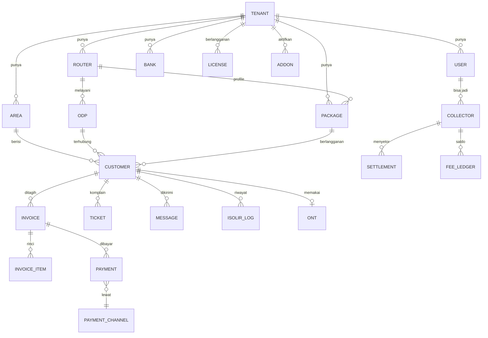

# 02 — BRD (Business Requirements Document) Sistem Billing WiFi/ISP

> Disusun dari hasil penelusuran **seluruh menu** dashboard Sisbro.id (akun contoh "NusaNet", role OWNER) pada 3 Okt 2026.
> Catatan: akun contoh masih kosong (0 pelanggan, 0 router), sehingga **kolom tabel & form** diambil dari struktur halaman, bukan dari data nyata. Bagian yang bersifat asumsi ditandai **[ASUMSI]**.

---

## 1. Ringkasan Eksekutif

Sisbro.id adalah **SaaS billing untuk ISP/RT-RW Net** (PT. Miber Digital Solusindo). Satu akun = satu usaha ISP (tenant). Sistem menghubungkan **data pelanggan & tagihan** dengan **perangkat jaringan milik ISP** (MikroTik, ONT/ACS) sehingga:

1. Tagihan dibuat otomatis tiap periode.
2. Pelanggan membayar lewat web/app/kolektor/payment gateway.
3. Setelah lunas, **internet dibuka otomatis**; bila telat, **diisolir otomatis** di MikroTik.
4. Admin memantau ONT, mengirim notifikasi WhatsApp, dan melihat laporan keuangan.

Tujuan produk Anda: membangun sistem serupa — **billing + otomasi hardware + portal bayar** — untuk ISP kecil-menengah di Indonesia.

---

## 2. Model Bisnis yang Teramati (Sisbro)

| Komponen | Tarif teramati |
|---|---|
| Lisensi inti | Rp 350 / pelanggan / bulan; minimum setara 100 pelanggan = **Rp 35.000 / bulan**; dibayar tiap **3 bulan**; telat > 7 hari → data otomatis terhapus |
| Halaman Isolir | Rp 10.000 / bulan / MikroTik |
| VPN Remote (L2TP/OVPN) | Rp 5.000 (per akun, 1 port remote) |
| MySender (WhatsApp) | Rp 500 / pesan, min. 250 pesan (Rp 125.000) |
| BayarWifi App (Android+iOS) | Rp 30.000 / bulan, min. 3 bulan (Rp 90.000) |
| Voucher Hotspot Online | Tanpa biaya bulanan; potong Rp 250 / voucher terjual |
| SisbroACS (monitoring/kontrol ONT) | Gratis masa tester; rencana ≈ Rp 250 / ONT / bulan |
| Bot MiberConnect (WA bot) | Gratis (pakai nomor WA sendiri) |
| Payment Gateway | Lewat **Miber HUB** (hub.miber.id), merchant harus disetujui |

**Pelajaran bisnis:** pendapatan = langganan per-pelanggan + add-on per-fitur + per-transaksi. Skema ini patut ditiru (mudah dijelaskan, tumbuh seiring pelanggan ISP).

---

## 3. Stakeholder & Aktor

| Aktor | Peran | Akses |
|---|---|---|
| **Owner ISP** | Pemilik usaha; atur identitas, lisensi, bank, gateway, karyawan | Semua menu |
| **Admin/CS** | Kelola pelanggan, tiket, pesan | Sesuai Jabatan & Hak Akses |
| **Teknisi** | Tangani tiket, pasang pelanggan, ODP | Tiket, ODP, ONT |
| **Kolektor** | Tagih tunai di lapangan, setor ke kantor | Aplikasi web kolektor (login Google) |
| **Agen/Marketing** | Referal pelanggan, dapat komisi | Reward Marketing |
| **Pelanggan** | Cek/bayar tagihan, ganti paket, komplain, ubah WiFi | Web bayar, App Android/iOS, Bot WhatsApp |
| **Pembeli voucher** | Beli voucher hotspot online | Web voucher |
| **Platform Super-Admin** | Operator SaaS (Anda) | Panel tenant, lisensi, tagihan add-on |
| **Sistem eksternal** | MikroTik, ACS (GenieACS/Sisbro), payment gateway, WhatsApp gateway | API |

---

## 4. Peta Menu Lengkap (Hasil Penelusuran)

Semua URL berada di bawah `apps.sisbro.id`.

### 4.1 Dashboard
`/dashboard` — ringkasan (di akun kosong menuju halaman Sistem Setting karena profil belum lengkap: "Silahkan lengkapi profile kamu"). **[ASUMSI]** berisi KPI: pelanggan aktif/isolir, tagihan bulan ini, pendapatan, tiket terbuka.

### 4.2 Setting Server (integrasi hardware)

| Menu | URL | Fungsi |
|---|---|---|
| Router Mikrotik | `/router` | Daftar router; kolom: No, VPN Koneksi (Utama/Backup), Auto Isolir, Aksi Isolir, Profile, Status, Mode Aktif, Aksi. Form `/router/create` (lihat §6.1) |
| SisbroACS | `/sisbroacs` | ACS terkelola untuk ONT: monitor RX Power, suhu, uptime, MAC, SN, IP WAN/PPP, online/offline; ganti SSID/password, restart, refresh, cek koneksi via VPN. Data tanpa VPN = read-only, jeda 5–15 menit |
| GenieACS | `/genieacs` | Daftar device TR-069 (filter: cari-berdasarkan, status Online/Offline); kolom: No, Device, Status, Product, Last Update; tab "Setting" |
| Import Data | `/importdata` | Impor pelanggan dari Excel (1–500 baris/unggah); kolom §6.4 |
| Generate Voucher | `/voucher` | Buat/kelola voucher hotspot langsung di MikroTik; kolom: Server, User, Password, Profiles, MAC, Uptime, Bytes In/Out, Comment |
| Cek Sinkron MT | `/auditscreets` | Bandingkan DB billing vs PPP secret di MikroTik (dua arah) + Export CSV |

### 4.3 Members & Billing (Kelola Data Pelanggan)

| Menu | URL | Fungsi |
|---|---|---|
| Setting Wilayah | `/area` | Master area/wilayah (desa/kecamatan/kota) |
| Setting ODP | `/odp` | Master ODP: Router, Nama ODP, Jumlah Slot, Terpakai, Sisa, Keterangan, Lokasi; tombol "Lihat Maps" |
| Setting Paket | `/settingpaket` | Master paket (§6.2) |
| Data Pelanggan | `/pelanggan` | Master pelanggan; **diblokir** (redirect) bila belum ada ≥ 1 paket: "SILAHKAN BUAT SETIDAKNYA 1 PAKET TAGIHAN" |
| Pendaftaran Online | `/pendaftaran` | Antrian calon pelanggan dari App/Web; filter Status (Pending/Disetujui/Ditolak), Sumber (Android App/Web Admin), tanggal. Kolom: ID, Tanggal, Sumber, Nama, Phone, NIK, Paket Pilihan, Alamat, Status, Action |
| Kolektor | `/kolektor` + sub | Data Kolektor, Setoran Kolektor, Riwayat Setoran, Fee Kolektor (§5.7) |
| Ticket Komplain | `/tickets` | Tiket gangguan: kartu OPEN/PROSES/AKTIF/SELESAI/SEMUA; kolom: Tanggal, Kode, Nama, Telp/WA, Detail Masalah, Action Team, Status; tab CHECKLIST & SETTING; Export |
| Pesan Otomatis | `/messages` | Antrian/log pesan; modul pengiriman; filter status (Belum selesai, Pending, Diproses, Sukses, Gagal Final); peringatan jika semua modul nonaktif |

### 4.4 Transaksi

| Menu | URL | Fungsi |
|---|---|---|
| Transaksi Lain-Lain | `/transaksi` | **[ASUMSI]** Pemasukan/pengeluaran non-tagihan (halaman ini menampilkan Master Bank di akun kosong — tertahan prasyarat bank) |
| Pembayaran Tagihan | `/payment` | Kasir pembayaran tagihan; **terkunci** bila belum ada Master Bank |
| Biaya & Diskon | `/biaya` | Tambah biaya/diskon saat bayar; filter Status (Open/Close), Tanggal, Area, ODP, Paket, User Input; kolom: Kode, Nama, Keterangan, Nominal, Status, Tgl Terbayar, Area, ODP, Paket, Pelanggan, Tarif Paket |

### 4.5 Laporan
Mutasi Keuangan (`/mutasi`), Reward Marketing (`/laporankomisi`), Log Isolir (`/laporanisolir`), Ganti Paket (`/laporanupgrade`), Penjualan Voucher (`/laporanvoucher`), Pembayaran Online (`/laporanpayment`), Invoice Unpaid (`/unpaid`), Log Open Isolir (`/erroropenisolir`), Laporan Omset (`/laporanomset`), Laporan Laba Rugi (`/laporanlabarugi`).

### 4.6 Setting (Identitas & Lisensi)

| Menu | URL | Fungsi |
|---|---|---|
| Master Bank | `/bankpt` | Rekening ISP untuk transfer manual: Bank, No Rekening, Atas Nama, Invoice |
| Payment Gateway → MIBER HUB | `/miberhub` | Isi CLIENT KEY & SECRET KEY → TEST KONEKSI → SIMPAN → AKTIFKAN LAYANAN |
| AddOn | `/vpnclient`, `/isolirpage`, `/senderpayment`, `/addonandroid`, `/hotspot`, `/addonqris`, `/miberconnect`, `/autobackup` | §5.9 |
| Karyawan | `/jabatan`, `/user`, `/histori_login`, `/pelanggan/loglist` | Jabatan & Hak Akses, Data Karyawan (email Google), Histori Login, Log Pelanggan |
| Sistem Setting | `/usaha` | 4 tab: Identitas, Widget, Riset Ulang Isolir, Lisensi (§6.5) |

> Halaman **Custom QRIS** dan **Auto Backup Router**, **Jabatan**, **Data Karyawan**, **Setting Wilayah**, serta sebagian laporan tidak sempat dibaca isinya (halaman tidak merespons saat dibuka). Fungsinya di sini disimpulkan dari nama menu & dokumentasi menu lain — **[ASUMSI]**, mohon diverifikasi.

---

## 5. Kebutuhan Fungsional (Functional Requirements)

Prioritas: **P0** wajib MVP, **P1** rilis ke-2, **P2** nanti.

### 5.1 Multi-tenant & Akun (FR-ACC)
| ID | Kebutuhan | Prio |
|---|---|---|
| FR-ACC-01 | Registrasi tenant (nama, WhatsApp, email), tanggal daftar, masa aktif lisensi | P0 |
| FR-ACC-02 | Isolasi data antar tenant (semua query berfilter `tenant_id`) | P0 |
| FR-ACC-03 | Login karyawan (email+password dan/atau Google SSO) | P0 |
| FR-ACC-04 | Jabatan & hak akses per menu/aksi (RBAC) | P0 |
| FR-ACC-05 | Histori login & log aktivitas pelanggan (audit trail) | P1 |
| FR-ACC-06 | Lisensi: hitung per pelanggan aktif, minimum tagihan, periode 3 bulanan, masa tenggang, **penghapusan data hanya setelah peringatan berulang** (rekomendasi: arsipkan, jangan langsung hapus) | P0 |

### 5.2 Identitas Usaha (FR-ID)
Jenis usaha, nama usaha, slogan, alamat, kota, telp, website/email, **pembulatan tagihan**, nama pemilik, WhatsApp, **catatan footer web bayar** (token `[ISOLIR]`), toggle *tampilkan periode pemakaian*, toggle *izinkan pendaftaran online*, **koordinat kantor** (peta Leaflet, radius pendaftaran 50 km), logo usaha (maks 15 KB), logo sistem (maks 5 MB, CDN). **P0**

### 5.3 Master Data (FR-MD)
| ID | Kebutuhan | Prio |
|---|---|---|
| FR-MD-01 | Wilayah/Area (CRUD) | P0 |
| FR-MD-02 | ODP: router, nama, kapasitas slot, terpakai, sisa (otomatis), keterangan, koordinat; peta semua ODP | P0 |
| FR-MD-03 | Paket: nama, kecepatan, izin upgrade/downgrade di app, izin pendaftaran online, harga dasar, PPN, total/bulan (otomatis), komisi agen, router, default profile (PPPoE) | P0 |
| FR-MD-04 | Master Bank | P0 |
| FR-MD-05 | Aturan prasyarat: pelanggan butuh ≥ 1 paket; pembayaran butuh ≥ 1 bank atau gateway | P0 |

### 5.4 Pelanggan (FR-CUS)
| ID | Kebutuhan | Prio |
|---|---|---|
| FR-CUS-01 | CRUD pelanggan dengan field §6.4 | P0 |
| FR-CUS-02 | Jenis billing: **Prabayar / Pascabayar** (kolom "Jenis Billing" + "Sudah Bayar") | P0 |
| FR-CUS-03 | Tanggal aktif & tanggal isolir per pelanggan | P0 |
| FR-CUS-04 | Pembuatan otomatis PPP Secret di MikroTik saat pelanggan dibuat/diubah | P0 |
| FR-CUS-05 | Impor Excel 1–500 baris + validasi per baris + laporan gagal | P0 |
| FR-CUS-06 | Cek sinkron DB ↔ MikroTik (dua arah) + ekspor CSV | P0 |
| FR-CUS-07 | Ganti paket (upgrade/downgrade) dengan aturan & log | P1 |
| FR-CUS-08 | Pencarian, filter area/ODP/paket/status, ekspor | P0 |

### 5.5 Pendaftaran Online (FR-REG)
Calon pelanggan mendaftar dari app/web → status **Pending** → admin **Setujui/Tolak** → bila disetujui otomatis menjadi pelanggan (+ komisi agen bila ada referal). Hanya paket "Pendaftaran Online" dan hanya dalam radius koordinat kantor. Bukti pendaftaran dikirim via WhatsApp. **P1**

### 5.6 Tagihan & Pembayaran (FR-BIL)
| ID | Kebutuhan | Prio |
|---|---|---|
| FR-BIL-01 | Generate invoice otomatis tiap periode (cron harian) dengan nomor unik | P0 |
| FR-BIL-02 | Komponen invoice: tarif paket, PPN, biaya tambahan, diskon, pembulatan | P0 |
| FR-BIL-03 | Pembayaran manual oleh kasir/admin (tunai, transfer ke Master Bank) | P0 |
| FR-BIL-04 | Pembayaran online via gateway (QRIS, VA, e-wallet, minimarket) dengan webhook idempoten | P0 |
| FR-BIL-05 | Bayar di muka beberapa bulan | P1 |
| FR-BIL-06 | Biaya & Diskon per-pelanggan/area/ODP/paket; status Open/Close | P1 |
| FR-BIL-07 | Transaksi lain-lain (pemasukan/pengeluaran di luar tagihan) | P1 |
| FR-BIL-08 | Struk/nota PDF + kirim WhatsApp | P0 |
| FR-BIL-09 | Pembatalan/koreksi transaksi dengan jejak audit (balikkan fee kolektor) | P0 |
| FR-BIL-10 | Invoice Unpaid (daftar tunggakan) | P0 |

### 5.7 Kolektor (FR-COL)
| ID | Kebutuhan | Prio |
|---|---|---|
| FR-COL-01 | Master kolektor (nama, phone, **fee default**, status, jumlah pelanggan dipegang, total tarif/bulan, perkiraan fee, pembayaran bulan ini) | P1 |
| FR-COL-02 | Aplikasi web kolektor (PWA, login Google; email harus terdaftar di Karyawan): tarik tunai, cek status internet pelanggan, cetak/bagikan bukti, riwayat setoran | P1 |
| FR-COL-03 | **Setoran**: kewajiban akumulatif (hutang lama + sisa wajib setor), buat setoran, riwayat | P1 |
| FR-COL-04 | **Fee kolektor**: saldo awal, fee bertambah (transaksi), fee batal (transaksi dihapus), dibayar, penyesuaian manual, saldo akhir; filter jenis mutasi | P1 |

### 5.8 Tiket Komplain (FR-TIC)
Buat tiket (dari admin, app, atau bot WA) → kode unik → status **OPEN → PROSES → SELESAI** → penugasan "Action Team" → checklist pekerjaan → notifikasi progres ke pelanggan → ekspor. **P1**

### 5.9 Add-On (FR-ADD)
| Add-on | Kebutuhan inti | Prio |
|---|---|---|
| **VPN Client** | Akun L2TP/OVPN per router, 1 akun = 1 remote port, port dapat diedit, script terminal siap-salin; dipakai agar API MikroTik bisa dijangkau tanpa IP publik | P0 |
| **Halaman Isolir** | Script per router (versi ROS 6/7), 1 lisensi = 1 router, tidak boleh dipakai ulang | P0 |
| **MySender (WA)** | Kuota prabayar, jenis pesan: Penagihan, Registrasi, OTP App, Pembayaran, Info Gangguan; jeda 1–5 menit; log histori; salah nomor tetap memotong kuota | P1 |
| **BayarWifi App** | App Android+iOS: bayar, riwayat, upgrade paket, tiket, slider/promo, info pelanggan, broadcast notif, log notif, pengguna aktif; tema warna; aturan downgrade | P2 |
| **Voucher Online** | Toko voucher per router (domain toko, coverage area, walled garden), produk (server hotspot, profile, panjang user, mode, kombinasi, batas waktu/data, harga) | P1 |
| **Custom QRIS** | QRIS milik ISP sendiri **[ASUMSI]** | P2 |
| **Bot MiberConnect** | Bot WA di nomor sendiri: cek tagihan, bayar, status koneksi, riwayat & struk, profil, beli voucher, komplain→tiket, hubungi admin; konfigurasi API Key + Secret Key + Callback URL | P2 |
| **Auto Backup Router** | Jadwal ekspor konfigurasi MikroTik **[ASUMSI]** | P2 |

### 5.10 Pesan Otomatis (FR-MSG)
Antrian pesan dengan modul pengirim (MySender/Bot/lainnya), status siklus: **Pending → Diproses → Sukses / Gagal Final**, hitungan percobaan (Hit), log API, tanggal status, jadwal kirim berikutnya, template pesan, kirim manual/broadcast. Sistem menampilkan peringatan bila **semua modul nonaktif**. **P0 (inti penagihan)**

### 5.11 Laporan (FR-REP)
Mutasi keuangan, reward marketing, log isolir, ganti paket, penjualan voucher, pembayaran online, invoice unpaid, log gagal open-isolir, omset, laba-rugi. Semua: filter periode, ekspor CSV/Excel. **P1**

### 5.12 Isolir Otomatis (FR-ISO)
Lihat flow di dokumen 03. Persyaratan: dua mode aksi (**Disable Secret** atau **Ubah Profile** ke profile isolir), jadwal berdasarkan tanggal isolir pelanggan, buka otomatis setelah bayar, log kegagalan, tombol **Riset Ulang Isolir**. **P0**

### 5.13 Monitoring ONT (FR-ACS)
Daftar ONT per MikroTik, status online/offline, RX power, suhu, uptime, MAC, SN, IP; aksi: ganti SSID/password, restart, refresh, cek koneksi. Mode live butuh VPN; tanpa VPN read-only dengan jeda. **P2**

---

## 6. Spesifikasi Data (Dari Form & Tabel yang Teramati)

### 6.1 Router MikroTik (`/router/create`)
| Bagian | Field | Keterangan |
|---|---|---|
| Kredensial Router | Username, Password | login API MikroTik (simpan terenkripsi!) |
| VPN Utama | Pilih VPN, **TEST KONEKSI** | wajib sukses sebelum SIMPAN |
| VPN Backup (opsional) | Pilih VPN, TEST KONEKSI | harus **berbeda** dari utama; kredensial router sama |
| Auto Isolir | Aktifkan (YA/TIDAK), Action Isolir (**Disable Secrets** / **Ubah Profile**), Profile Isolir | |
| Bantuan | "PORT API" di *IP > Services > api*, daftarkan port API ke VPN Client | |

Kolom daftar: VPN koneksi (utama/backup), Auto Isolir, Aksi Isolir, Profile, Status, Mode Aktif, Aksi.

### 6.2 Paket (`/settingpaket/create`)
Nama Paket · Kecepatan · Izinkan Upgrade/Downgrade di App (YA/TIDAK) · Izinkan Pendaftaran Online (YA/TIDAK) · Harga Dasar · PPN · **Tarif/Bulan** (otomatis) · Komisi Agen/Referal · Router · Default Profile (profile PPPoE di router terpilih).

### 6.3 ODP
Router, Nama ODP, Jumlah Slot, Terpakai (otomatis dari pelanggan), Sisa, Keterangan, Lokasi (lat/long).

### 6.4 Pelanggan (dari kolom Import Excel)
Nama · Phone · Desa · Kecamatan · Kota · Alamat · Area · Paket · Tarif · ODP · Service (pppoe/hotspot…) · User Secret · Password · Local Address · Remote Address · Jenis Billing (pra/pasca) · Sudah Bayar · Tanggal Aktif · Isolir (tanggal) · Nomor KTP · PPN · Lokasi Pelanggan (koordinat).

### 6.5 Sistem Setting (`/usaha`)
Tab **Identitas** (§5.2) · **Widget** (embed/tampilan web bayar **[ASUMSI]**) · **Riset Ulang Isolir** (reset penjadwalan isolir) · **Lisensi** (nama, WA, tanggal daftar, masa aktif, jumlah pelanggan, total tagihan, catatan aturan lisensi).

### 6.6 Entitas Inti (ERD Ringkas)

---

## 7. Kebutuhan Non-Fungsional (NFR)

| Kategori | Persyaratan |
|---|---|
| Keamanan | Password router & API key **dienkripsi** (AES-GCM/KMS), tidak pernah ditampilkan ulang; TLS wajib; RBAC; rate-limit & captcha di web bayar; token tagihan berumur pendek |
| Idempotensi | Webhook gateway & job isolir aman dijalankan ulang (kunci idempoten per invoice/payment) |
| Ketersediaan | Job isolir/open **tidak boleh** menghilangkan pelanggan: retry dengan backoff + log "Gagal Final" |
| Ketahanan hardware | Router offline → antrikan perintah, lanjut saat online; VPN backup untuk redundansi |
| Performa | Web bayar < 2,5 s LCP; query tagihan < 300 ms |
| Skalabilitas | Target awal 100 tenant × 1.000 pelanggan; worker antrian terpisah dari web |
| Audit | Semua perubahan finansial & aksi isolir tercatat (siapa, kapan, sebelum/sesudah) |
| Zona waktu | Simpan UTC, tampilkan WIB/WITA/WIT per tenant |
| Privasi | NIK dienkripsi/dimasking; patuh UU PDP; kebijakan retensi data |
| Cadangan | Backup DB harian + uji restore; ekspor data tenant |
| Lokalisasi | Rupiah tanpa desimal, tanggal dd-mm-yyyy |

---

## 8. Aturan Bisnis Penting

1. Pelanggan tidak bisa dibuat tanpa paket; kasir tidak bisa dipakai tanpa bank/gateway.
2. **Harga total = harga dasar + PPN**; pembulatan sesuai pengaturan usaha.
3. Isolir mengikuti **tanggal isolir pelanggan** (bukan sama untuk semua).
4. Pembayaran lunas → **buka isolir otomatis**; bila gagal, masuk "Log Open Isolir" untuk ditindaklanjuti.
5. Pelanggan boleh upgrade di app hanya bila paket & akunnya memenuhi syarat (bukan pelanggan baru, belum pernah upgrade di periode ini, layanan aktif, paket mendukung, tidak di akhir periode); downgrade bergantung pengaturan tenant.
6. Komisi agen dibayar dari paket yang didaftarkan referal.
7. Fee kolektor bertambah saat transaksi tunai dan **berkurang saat transaksi dibatalkan**.
8. Pesan WA gagal (nomor salah) tetap memotong kuota — tampilkan peringatan validasi nomor sebelum kirim.
9. Lisensi lewat jatuh tempo: peringatan bertahap → suspend → arsip (jangan hapus instan).

---

## 9. Ruang Lingkup MVP vs Rilis Berikut

| Rilis | Isi |
|---|---|
| **MVP (P0)** | Tenant+RBAC, Identitas, Wilayah/ODP/Paket/Bank, Pelanggan (+impor, +sinkron), Router MikroTik (+VPN), Invoice otomatis, Pembayaran manual + 1 gateway (QRIS/VA), Web bayar & struk, Isolir/Open otomatis + halaman isolir, Pesan WA penagihan/pembayaran, Laporan unpaid & omset |
| **Rilis 2 (P1)** | Pendaftaran online, Kolektor+setoran+fee, Tiket, Biaya & Diskon, Transaksi lain, Voucher hotspot, laporan lengkap |
| **Rilis 3 (P2)** | App Android/iOS, Bot WA, ACS/ONT, Custom QRIS, Auto backup, Reward marketing lanjutan |

---

## 10. Risiko & Mitigasi

| Risiko | Dampak | Mitigasi |
|---|---|---|
| Router tidak punya IP publik | API tidak terjangkau | VPN (WireGuard/L2TP/OVPN) di sisi router → server |
| Kredensial router bocor | Pengambilalihan jaringan | Enkripsi, user API khusus dengan hak minimum, IP allow-list |
| Webhook ganda / terlambat | Dobel catat / salah isolir | Idempotensi + rekonsiliasi harian |
| Salah isolir massal (bug) | Pelanggan marah | Mode *dry-run*, batas maksimum per eksekusi, tombol batalkan |
| Perbedaan versi RouterOS 6/7 | Perintah gagal | Deteksi versi otomatis, template per versi |
| Ketergantungan gateway | Pembayaran down | Dukung >1 gateway + transfer manual |
| Penghapusan data lisensi | Kehilangan data tenant | Arsip & ekspor sebelum hapus |

---

## 11. Kriteria Penerimaan (UAT) Ringkas

- Tambah router → TEST KONEKSI sukses → tersimpan; kredensial tidak terlihat lagi.
- Buat paket + pelanggan → PPP secret muncul di MikroTik dengan profile benar (≤ 10 detik).
- Invoice terbit otomatis; bayar via QRIS sandbox → status Lunas ≤ 10 detik; pelanggan terisolir kembali aktif ≤ 60 detik.
- Pelanggan lewat tanggal isolir → otomatis terisolir & masuk Log Isolir; membuka sembarang situs diarahkan ke halaman isolir.
- Cek Sinkron menampilkan selisih DB vs MikroTik dengan benar.
- Webhook dikirim 2× → hanya 1 pembayaran tercatat.

---

## 12. Glosarium

**ODP** Optical Distribution Point · **ONT** perangkat terminal serat di rumah pelanggan · **ACS** Auto Configuration Server (TR-069) · **PPPoE/PPP Secret** akun login pelanggan di MikroTik · **Profile** paket kecepatan/pool IP di MikroTik · **Isolir** pemutusan sementara karena telat bayar · **Walled garden** daftar situs yang tetap boleh diakses saat terisolir · **VA** Virtual Account · **QRIS** standar QR pembayaran Indonesia · **Kolektor** penagih lapangan · **RT/RW Net** ISP skala lingkungan.
