# BILLINGIN — Dokumen Rancangan Backend

> Platform billing & pembayaran WiFi multi-mitra (multi-ISP) · **Laravel + SQL Server + Midtrans + MikroTik + WhatsApp + Docker**
> Versi 0.1 (Draft) · 3 Oktober 2026 · Penyusun: Wahyu Prayoga
> Sumber: `BRD-website-pembayaran-wifi.md` (BRD-A) dan `02_BRD_BILLING_WIFI.md` (BRD-B)
> Semua diagram memakai **Mermaid** (tampil otomatis di GitHub, GitLab, VS Code, Notion, Obsidian).

---

## Daftar Isi

1. Keputusan yang sudah ditetapkan & asumsi
2. Arsitektur sistem
3. Stack teknologi & struktur proyek Laravel
4. Multi-tenant & hak akses (RBAC)
5. ERD & rancangan database (SQL Server)
6. Diagram status (state machine)
7. Aturan bisnis & perhitungan
8. Flow chart & activity diagram
9. Sequence diagram integrasi
10. Desain modul jaringan (MikroTik driver)
11. Integrasi Midtrans
12. Notifikasi WhatsApp
13. Rancangan API (route)
14. Scheduler & queue job
15. Keamanan, audit, dan privasi
16. Deployment Docker
17. Strategi pengujian & kriteria penerimaan
18. Urutan pembangunan (roadmap teknis)
19. Keputusan terbuka & konflik antar dokumen

---

## 1. Keputusan yang sudah ditetapkan & asumsi

### 1.1 Keputusan (dari pemilik produk)

| Area | Keputusan |
|---|---|
| Brand | **BILLINGIN** |
| Backend | **Laravel** (PHP), arsitektur modular monolith |
| Database | **Microsoft SQL Server** |
| Frontend | Dipilih oleh perancang: **Inertia.js + Vue 3 + TypeScript + Tailwind** (alasan di §3.3) |
| Payment gateway | **Midtrans**, metode **QRIS** dan **transfer manual** (verifikasi oleh admin ISP) |
| Biaya admin gateway | **Ditanggung pelanggan** (ditambahkan ke total bayar online) |
| Jaringan | **MikroTik**, kontrol **PPPoE** atau **manual**. Bisa berubah → dibuat sebagai *driver* yang bisa ditukar per router |
| Hosting | **Docker** |
| Model pengguna | **Multi-mitra**: banyak ISP dalam satu platform |
| Peran | **Superadmin** (Anda), **Admin ISP**, **Pelanggan** |
| Notifikasi | **WhatsApp** |
| Cakupan MVP | **Semua fitur** (voucher, aplikasi pelanggan, pendaftaran online, dsb.). Urutan bangun ada di §18 |
| Notifikasi warna | **Merah** saat jatuh tempo, **kuning** saat masa tenggang (lihat catatan di §7.3) |

### 1.2 Asumsi yang saya ambil (mohon dikoreksi)

| # | Asumsi | Dampak bila salah |
|---|---|---|
| A1 | **Dana QRIS langsung ke akun Midtrans milik tiap ISP** (kunci Midtrans disimpan per tenant, terenkripsi). Platform tidak memegang uang pelanggan | Bila dana harus lewat platform, perlu modul settlement/payout + kajian legal. Skema `gateway_accounts` sudah mendukung scope `platform` |
| A2 | Tarif biaya gateway **tidak ditulis permanen di kode**, disimpan di konfigurasi (`gateway_fee_rules`). Nilai awal QRIS hanya placeholder, **wajib dicek di kontrak Midtrans Anda** | Total bayar pelanggan salah bila tarif tidak cocok |
| A3 | Satu pelanggan = satu layanan (satu akun PPPoE) di MVP | Multi-layanan per pelanggan butuh tabel `services` terpisah |
| A4 | Role **kolektor, teknisi, kasir** dibuat sebagai *role kustom milik Admin ISP* (permission-based), bukan role bawaan sistem | Bila ingin role bawaan, tinggal seed ulang |
| A5 | WhatsApp dikirim lewat **abstraksi driver** (gateway resmi atau tidak resmi bisa ditukar). Pilihan provider belum ditetapkan | Risiko blokir nomor tergantung provider |
| A6 | Pelanggan login di web/app memakai **nomor HP + OTP WhatsApp**. Halaman bayar publik **tanpa login** (token tagihan berumur pendek) | Sesuai BRD-A BR-02 |
| A7 | Zona waktu: simpan **UTC**, tampil sesuai zona tenant (WIB/WITA/WIT) | Sesuai NFR kedua BRD |
| A8 | Satu database untuk semua tenant, dipisah kolom `tenant_id` (+ opsional Row-Level Security SQL Server) | Database per tenant lebih mahal dan sulit dioperasikan |

---

## 2. Arsitektur sistem

### 2.1 Konteks sistem

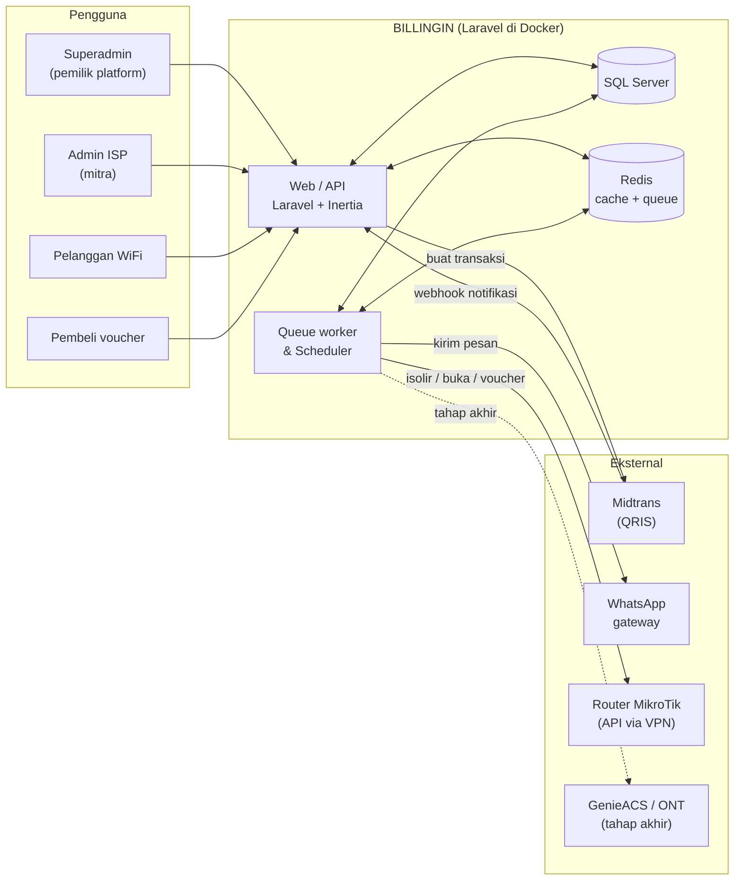

### 2.2 Komponen kontainer (Docker)

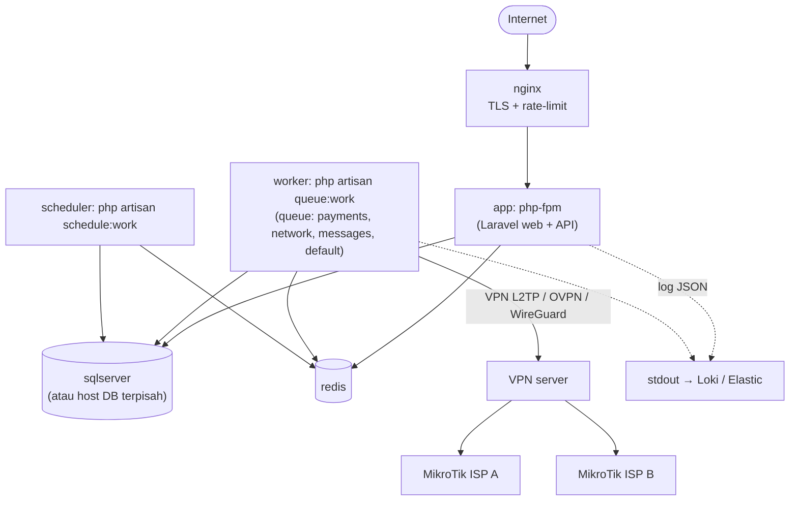

Catatan desain:
- **Web** dan **worker** memakai image yang sama, beda perintah. Worker tidak boleh berbagi proses dengan web agar job isolir yang lama tidak memperlambat halaman bayar.
- Antrian dipisah per jenis supaya antrian pesan WhatsApp yang macet tidak menahan pembukaan isolir: `payments` (prioritas tertinggi), `network`, `messages`, `default`.
- Router MikroTik jarang punya IP publik, jadi akses API lewat **VPN**. Server VPN bisa kontainer terpisah atau layanan yang sudah ada.

---

## 3. Stack teknologi & struktur proyek Laravel

### 3.1 Stack backend

| Kebutuhan | Pilihan | Catatan |
|---|---|---|
| Framework | Laravel (versi LTS/terbaru yang stabil saat mulai) | Cek versi PHP minimum di dokumentasi Laravel saat memulai |
| Driver DB | `pdo_sqlsrv` + `sqlsrv` + **Microsoft ODBC Driver 18** | Perlu dipasang di image Docker (lihat §16) |
| Auth web admin | Laravel session + **Fortify** (2FA TOTP untuk superadmin dan admin ISP) | |
| Auth API/mobile | **Sanctum** (token) | Guard terpisah: `web` (admin), `customer` (pelanggan) |
| RBAC | `spatie/laravel-permission` dengan mode **teams** (`tenant_id` sebagai team) | |
| Antrian | **Redis** + **Horizon** | |
| Audit | `spatie/laravel-activitylog` atau tabel `audit_logs` sendiri | |
| Midtrans | `midtrans/midtrans-php` **atau** HTTP client sendiri di balik `PaymentGatewayInterface` | |
| MikroTik | `evilfreelancer/routeros-api-php` (RouterOS API) di balik `NetworkDriverInterface` | |
| PDF struk | `barryvdh/laravel-dompdf` atau `spatie/laravel-pdf` | |
| Impor Excel | `maatwebsite/excel` | Maks 500 baris per unggah (BRD-B) |
| Peta/lokasi | Simpan lat/long saja, peta di frontend (Leaflet) | |
| Pengujian | **Pest** + `Http::fake()` untuk Midtrans/WA, mock untuk MikroTik | |

> Versi paket di atas hanya nama. Sebelum mulai, cek kompatibilitas versi Laravel ↔ paket ↔ driver SQL Server di dokumentasi masing-masing.

### 3.2 Struktur proyek (modular monolith)

```
app/
├── Modules/
│   ├── Platform/        # tenant, lisensi, addon, tagihan platform (Superadmin)
│   ├── Identity/        # user, role, permission, histori login, audit
│   ├── Master/          # area, ODP, paket, bank, router
│   ├── Customer/        # pelanggan, impor, ganti paket, sinkron router
│   ├── Registration/    # pendaftaran online
│   ├── Billing/         # invoice, biaya/diskon, generator, pengingat
│   ├── Payment/         # pembayaran, Midtrans, transfer manual, webhook, struk
│   ├── Network/         # driver MikroTik/manual, isolir, antrian perintah
│   ├── Voucher/         # produk, order, pembuatan user hotspot
│   ├── Collector/       # kolektor, setoran, fee
│   ├── Ticket/          # tiket komplain
│   ├── Messaging/       # template, antrian pesan, driver WhatsApp
│   ├── Report/          # laporan & ekspor
│   └── Ont/             # integrasi ACS (tahap akhir)
├── Support/             # trait BelongsToTenant, Money, Idempotency, Crypto
bootstrap/ config/ database/migrations routes/{web,api,webhook}.php
docker/ (Dockerfile, nginx, supervisor)
```

Aturan modul:
- Antar modul **hanya berbicara lewat Service/Action dan Event**, tidak langsung query tabel modul lain.
- Event utama: `InvoiceCreated`, `InvoicePaid`, `InvoiceOverdue`, `CustomerIsolated`, `CustomerReopened`, `PaymentFailed`, `RegistrationApproved`.
- Listener berat selalu dijalankan **lewat queue**.

### 3.3 Frontend yang saya rekomendasikan

**Inertia.js + Vue 3 + TypeScript + Tailwind CSS** (komponen gaya shadcn-vue, token warna lewat CSS variables untuk mode gelap/terang).

Alasan:
1. Satu repo Laravel, tanpa membangun API terpisah untuk dashboard. Tim kecil dan MVP 8–10 minggu (BRD-A) jadi realistis.
2. Token desain (dark modern + terang) mudah dipetakan ke CSS variables, sesuai prompt desain BILLINGIN.
3. Halaman bayar pelanggan dan web kolektor dibuat sebagai **PWA** (cukup untuk "aplikasi pelanggan" tahap awal, tanpa Android/iOS native).
4. Landing page marketing pakai Blade/Inertia SSR agar SEO baik.
5. API `/api/v1` tetap dibuat (Sanctum) untuk aplikasi mobile native di tahap akhir. Dokumen frontend dibuat terpisah.

---

## 4. Multi-tenant & hak akses (RBAC)

### 4.1 Model tenant

- **1 tenant = 1 ISP (mitra)**. Semua tabel data bisnis punya `tenant_id`.
- Trait `BelongsToTenant` menambahkan **global scope** `where tenant_id = <tenant aktif>` dan mengisi `tenant_id` otomatis saat `creating`.
- Tenant aktif diambil dari user yang login, atau dari **subdomain/slug** pada halaman bayar publik (`bayar.billingin.id/{slug}` atau `{slug}.billingin.id`).
- **Lapis kedua (pertahanan berlapis):** SQL Server **Row-Level Security** memakai `SESSION_CONTEXT('tenant_id')` yang diset middleware pada tiap koneksi. Jika global scope terlupa di suatu query, database tetap menolak membaca data tenant lain.
- Job queue **wajib membawa `tenant_id`** dan menyetel konteks tenant sebelum berjalan (middleware job `SetTenantContext`).

### 4.2 Peran

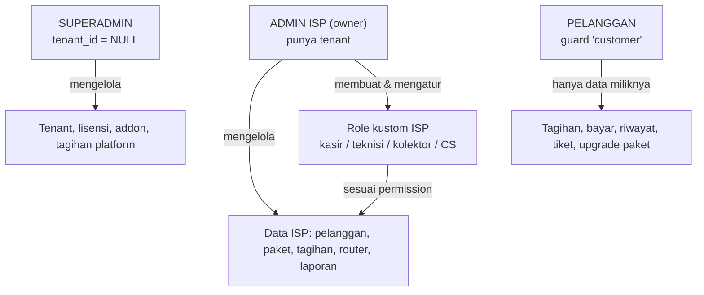

| Peran | Guard | Cakupan |
|---|---|---|
| Superadmin | `web` | Lintas tenant: tenant, lisensi, tagihan platform, impersonasi (tercatat audit), pengaturan global, monitoring antrian |
| Admin ISP | `web` | Seluruh data tenant sendiri + atur karyawan dan hak akses |
| Role kustom ISP | `web` | Dibatasi permission (mis. kasir hanya `payment.create`, kolektor hanya setoran) |
| Pelanggan | `customer` | Hanya data dirinya sendiri; login HP + OTP WhatsApp |

### 4.3 Contoh daftar permission

`customer.view|create|update|delete|import` · `invoice.view|create|void` · `payment.view|create|verify|void` · `router.manage` · `network.isolir|reopen` · `package.manage` · `voucher.manage` · `collector.manage|settle` · `ticket.view|assign|close` · `report.view|export` · `message.send|broadcast` · `settings.manage` · `staff.manage`

---

## 5. ERD & rancangan database (SQL Server)

> Konvensi: PK `id` bigint identity · uang dalam **rupiah bulat (bigint)**, tanpa desimal · waktu `datetime2(0)` UTC · status berupa `nvarchar` + `CHECK` · JSON disimpan `nvarchar(max)` + `CHECK (ISJSON(...)=1)` · soft delete `deleted_at` untuk data bisnis · semua tabel bisnis berisi `tenant_id` + `created_at/updated_at`.

### 5.1 ERD 1: Platform, identitas, master data

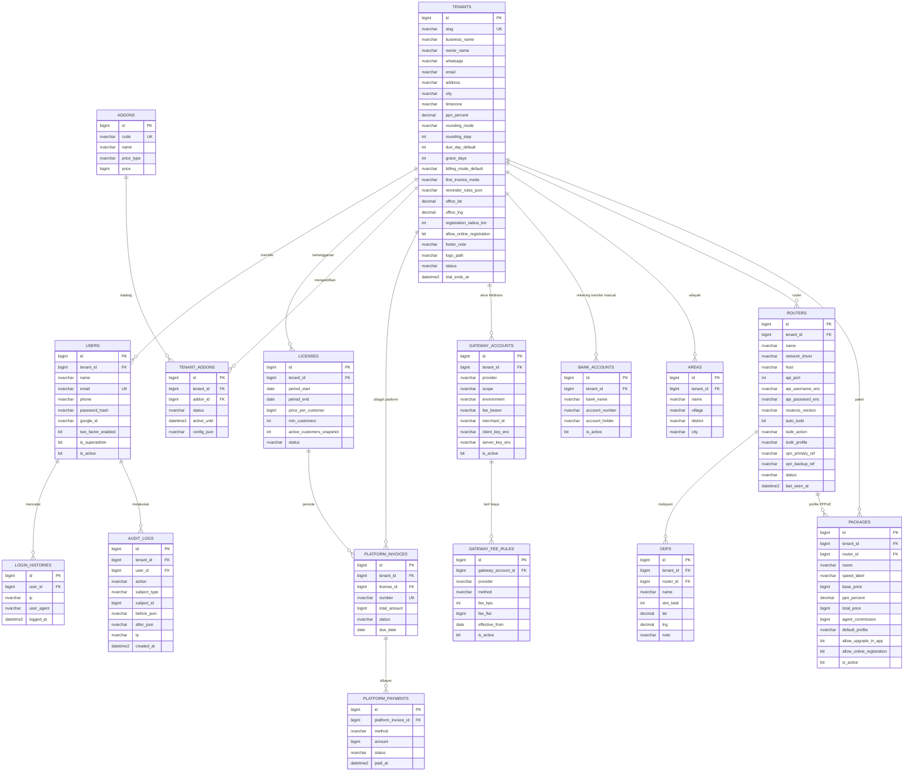

### 5.2 ERD 2: Pelanggan, pendaftaran, agen, tiket

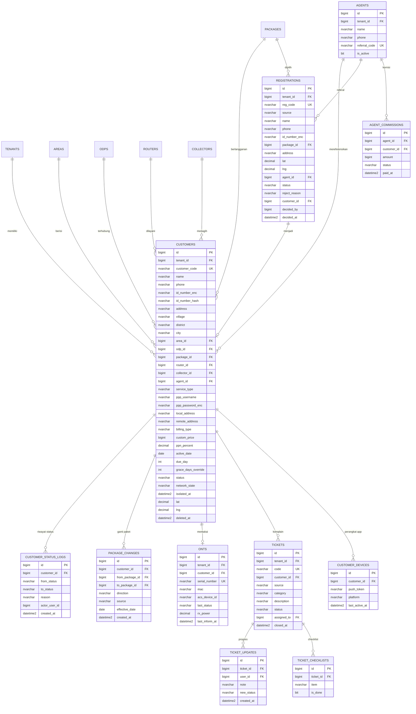

### 5.3 ERD 3: Tagihan, pembayaran, kolektor, keuangan

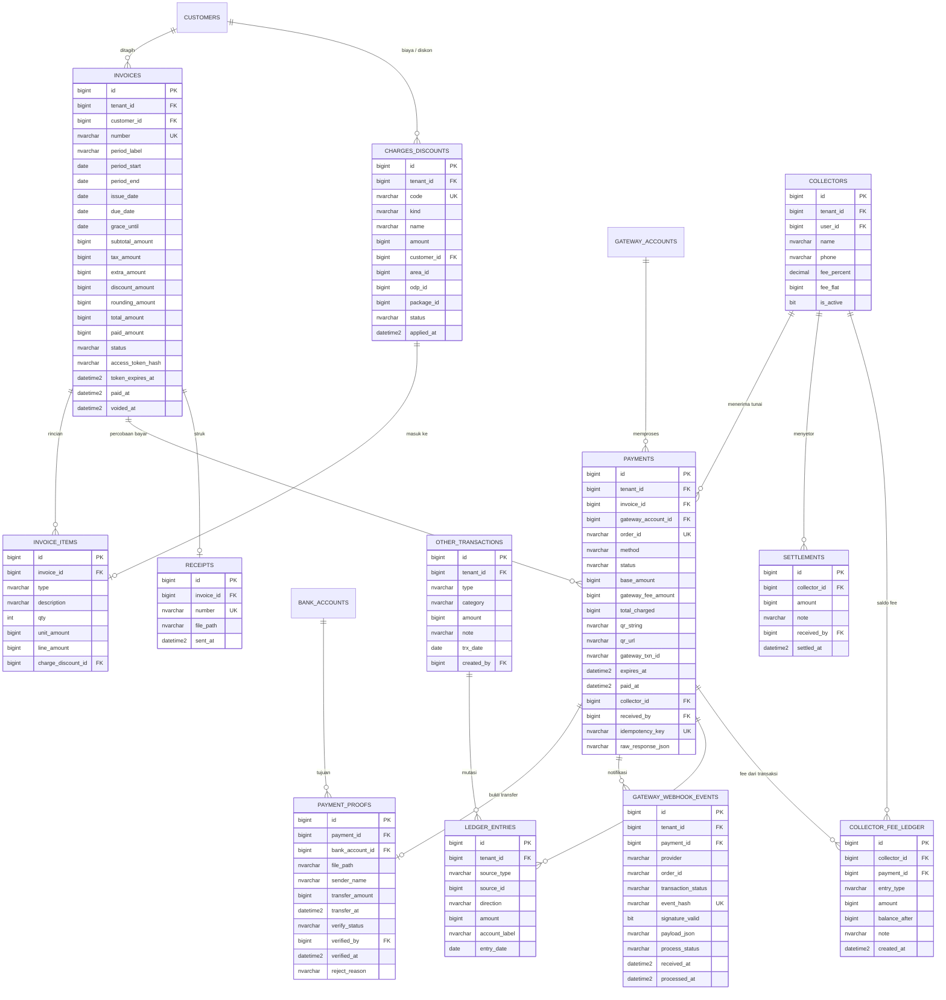

### 5.4 ERD 4: Jaringan, voucher, pesan

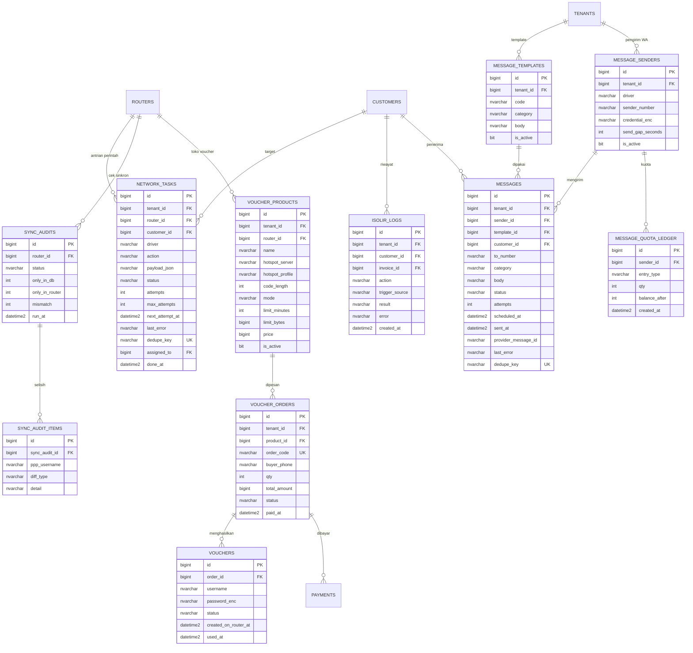

### 5.5 Ringkasan relasi lintas domain

| Dari | Ke | Kardinalitas | Catatan |
|---|---|---|---|
| tenants | hampir semua tabel bisnis | 1 : N | wajib, indeks pertama pada tiap tabel bisnis |
| customers | invoices | 1 : N | satu invoice per periode (unik per customer+period) |
| invoices | payments | 1 : N | percobaan bayar boleh banyak (QRIS kedaluwarsa → buat baru), hanya satu yang `paid` |
| payments | gateway_webhook_events | 1 : N | menyimpan semua notifikasi mentah, idempotensi pakai `event_hash` unik |
| customers | network_tasks | 1 : N | satu perintah jaringan = satu baris, dengan `dedupe_key` |
| registrations | customers | 1 : 0..1 | terisi setelah disetujui |

### 5.6 DDL SQL Server untuk tabel kritis

> Migrasi Laravel menghasilkan struktur serupa. DDL di sini sebagai acuan indeks, constraint, dan tipe data.

```sql
-- ============ TENANTS ============
CREATE TABLE tenants (
  id            BIGINT IDENTITY(1,1) PRIMARY KEY,
  slug          NVARCHAR(60)  NOT NULL,
  business_name NVARCHAR(150) NOT NULL,
  owner_name    NVARCHAR(120) NULL,
  whatsapp      NVARCHAR(20)  NULL,
  email         NVARCHAR(150) NULL,
  timezone      NVARCHAR(40)  NOT NULL DEFAULT 'Asia/Jakarta',
  ppn_percent   DECIMAL(5,2)  NOT NULL DEFAULT 0,
  rounding_step INT           NOT NULL DEFAULT 1,       -- 1 = tanpa pembulatan, 100, 500, 1000
  due_day_default INT         NOT NULL DEFAULT 10,
  grace_days    INT           NOT NULL DEFAULT 3,
  first_invoice_mode NVARCHAR(10) NOT NULL DEFAULT 'full',   -- full | prorata
  reminder_rules_json NVARCHAR(MAX) NULL,                   -- pemetaan fase -> warna/template
  status        NVARCHAR(20)  NOT NULL DEFAULT 'trial',
  trial_ends_at DATETIME2(0)  NULL,
  created_at    DATETIME2(0)  NOT NULL DEFAULT SYSUTCDATETIME(),
  updated_at    DATETIME2(0)  NOT NULL DEFAULT SYSUTCDATETIME(),
  CONSTRAINT uq_tenants_slug UNIQUE (slug),
  CONSTRAINT ck_tenants_status CHECK (status IN ('trial','active','suspended','archived'))
);

-- ============ CUSTOMERS ============
CREATE TABLE customers (
  id              BIGINT IDENTITY(1,1) PRIMARY KEY,
  tenant_id       BIGINT        NOT NULL REFERENCES tenants(id),
  customer_code   NVARCHAR(30)  NOT NULL,
  name            NVARCHAR(150) NOT NULL,
  phone           NVARCHAR(20)  NOT NULL,
  id_number_enc   NVARCHAR(400) NULL,        -- NIK terenkripsi (Crypt)
  id_number_hash  CHAR(64)      NULL,        -- HMAC untuk pencarian/deteksi duplikat
  area_id         BIGINT NULL, odp_id BIGINT NULL,
  package_id      BIGINT        NOT NULL,
  router_id       BIGINT        NULL,
  collector_id    BIGINT NULL, agent_id BIGINT NULL,
  service_type    NVARCHAR(10)  NOT NULL DEFAULT 'pppoe',
  ppp_username    NVARCHAR(80)  NULL,
  ppp_password_enc NVARCHAR(400) NULL,
  billing_type    NVARCHAR(10)  NOT NULL DEFAULT 'postpaid',   -- postpaid | prepaid
  due_day         INT           NULL,
  grace_days_override INT       NULL,
  status          NVARCHAR(12)  NOT NULL DEFAULT 'active',     -- bisnis
  network_state   NVARCHAR(12)  NOT NULL DEFAULT 'open',       -- teknis: open | isolated | unknown
  isolated_at     DATETIME2(0)  NULL,
  deleted_at      DATETIME2(0)  NULL,
  created_at DATETIME2(0) NOT NULL DEFAULT SYSUTCDATETIME(),
  updated_at DATETIME2(0) NOT NULL DEFAULT SYSUTCDATETIME(),
  CONSTRAINT ck_customers_status CHECK (status IN ('pending','active','suspended','stopped')),
  CONSTRAINT ck_customers_net    CHECK (network_state IN ('open','isolated','unknown'))
);
-- kode & akun PPPoE unik per tenant (abaikan baris yang dihapus lunak)
CREATE UNIQUE INDEX uq_customers_code ON customers (tenant_id, customer_code) WHERE deleted_at IS NULL;
CREATE UNIQUE INDEX uq_customers_ppp  ON customers (tenant_id, router_id, ppp_username)
  WHERE deleted_at IS NULL AND ppp_username IS NOT NULL;
CREATE INDEX ix_customers_phone  ON customers (tenant_id, phone);
CREATE INDEX ix_customers_status ON customers (tenant_id, status, network_state);

-- ============ INVOICES ============
CREATE TABLE invoices (
  id             BIGINT IDENTITY(1,1) PRIMARY KEY,
  tenant_id      BIGINT       NOT NULL REFERENCES tenants(id),
  customer_id    BIGINT       NOT NULL REFERENCES customers(id),
  number         NVARCHAR(40) NOT NULL,
  period_label   NVARCHAR(7)  NOT NULL,                  -- '2026-10'
  period_start   DATE NOT NULL, period_end DATE NOT NULL,
  issue_date     DATE NOT NULL, due_date DATE NOT NULL, grace_until DATE NOT NULL,
  subtotal_amount BIGINT NOT NULL DEFAULT 0,
  tax_amount      BIGINT NOT NULL DEFAULT 0,
  extra_amount    BIGINT NOT NULL DEFAULT 0,
  discount_amount BIGINT NOT NULL DEFAULT 0,
  rounding_amount BIGINT NOT NULL DEFAULT 0,
  total_amount    BIGINT NOT NULL,
  paid_amount     BIGINT NOT NULL DEFAULT 0,
  status          NVARCHAR(12) NOT NULL DEFAULT 'unpaid',
  access_token_hash CHAR(64) NULL,
  token_expires_at  DATETIME2(0) NULL,
  paid_at DATETIME2(0) NULL, voided_at DATETIME2(0) NULL,
  created_at DATETIME2(0) NOT NULL DEFAULT SYSUTCDATETIME(),
  updated_at DATETIME2(0) NOT NULL DEFAULT SYSUTCDATETIME(),
  CONSTRAINT ck_invoices_status CHECK (status IN ('unpaid','pending','paid','void')),
  CONSTRAINT ck_invoices_total  CHECK (total_amount >= 0 AND paid_amount >= 0)
);
CREATE UNIQUE INDEX uq_invoices_number ON invoices (tenant_id, number);
-- satu invoice per pelanggan per periode: generator aman dijalankan ulang
CREATE UNIQUE INDEX uq_invoices_period ON invoices (customer_id, period_label) WHERE status <> 'void';
CREATE INDEX ix_invoices_due ON invoices (tenant_id, status, due_date) INCLUDE (customer_id, total_amount);

-- ============ PAYMENTS ============
CREATE TABLE payments (
  id               BIGINT IDENTITY(1,1) PRIMARY KEY,
  tenant_id        BIGINT NOT NULL REFERENCES tenants(id),
  invoice_id       BIGINT NULL REFERENCES invoices(id),       -- NULL jika pembayaran voucher
  voucher_order_id BIGINT NULL,
  gateway_account_id BIGINT NULL,
  order_id         NVARCHAR(64) NOT NULL,                     -- dikirim ke Midtrans, unik global
  method           NVARCHAR(20) NOT NULL,                     -- qris | manual_transfer | cash
  status           NVARCHAR(12) NOT NULL DEFAULT 'pending',
  base_amount      BIGINT NOT NULL,                           -- nominal tagihan
  gateway_fee_amount BIGINT NOT NULL DEFAULT 0,               -- ditanggung pelanggan
  total_charged    BIGINT NOT NULL,                           -- = gross_amount ke Midtrans
  qr_string NVARCHAR(MAX) NULL, qr_url NVARCHAR(500) NULL,
  gateway_txn_id   NVARCHAR(80) NULL,
  expires_at DATETIME2(0) NULL, paid_at DATETIME2(0) NULL,
  collector_id BIGINT NULL, received_by BIGINT NULL,
  idempotency_key  NVARCHAR(80) NULL,
  raw_response_json NVARCHAR(MAX) NULL,
  created_at DATETIME2(0) NOT NULL DEFAULT SYSUTCDATETIME(),
  updated_at DATETIME2(0) NOT NULL DEFAULT SYSUTCDATETIME(),
  CONSTRAINT ck_payments_status CHECK (status IN ('pending','paid','failed','expired','cancelled','awaiting_verification','rejected','refunded')),
  CONSTRAINT ck_payments_method CHECK (method IN ('qris','manual_transfer','cash')),
  CONSTRAINT ck_payments_json   CHECK (raw_response_json IS NULL OR ISJSON(raw_response_json) = 1)
);
CREATE UNIQUE INDEX uq_payments_order ON payments (order_id);
CREATE UNIQUE INDEX uq_payments_idem  ON payments (idempotency_key) WHERE idempotency_key IS NOT NULL;
-- hanya SATU pembayaran 'paid' per invoice: pagar terakhir melawan webhook ganda
CREATE UNIQUE INDEX uq_payments_one_paid ON payments (invoice_id) WHERE status = 'paid' AND invoice_id IS NOT NULL;
CREATE INDEX ix_payments_invoice ON payments (invoice_id, status);

-- ============ GATEWAY_WEBHOOK_EVENTS (idempotensi) ============
CREATE TABLE gateway_webhook_events (
  id            BIGINT IDENTITY(1,1) PRIMARY KEY,
  tenant_id     BIGINT NULL,
  payment_id    BIGINT NULL,
  provider      NVARCHAR(20) NOT NULL DEFAULT 'midtrans',
  order_id      NVARCHAR(64) NOT NULL,
  transaction_status NVARCHAR(30) NOT NULL,
  event_hash    CHAR(64) NOT NULL,            -- SHA256(provider|order_id|transaction_status|transaction_id|gross_amount)
  signature_valid BIT NOT NULL,
  payload_json  NVARCHAR(MAX) NOT NULL,
  process_status NVARCHAR(12) NOT NULL DEFAULT 'received',  -- received|processed|ignored|failed
  received_at   DATETIME2(0) NOT NULL DEFAULT SYSUTCDATETIME(),
  processed_at  DATETIME2(0) NULL,
  CONSTRAINT uq_webhook_hash UNIQUE (event_hash),
  CONSTRAINT ck_webhook_json CHECK (ISJSON(payload_json) = 1)
);

-- ============ NETWORK_TASKS (antrian perintah router) ============
CREATE TABLE network_tasks (
  id            BIGINT IDENTITY(1,1) PRIMARY KEY,
  tenant_id     BIGINT NOT NULL,
  router_id     BIGINT NOT NULL,
  customer_id   BIGINT NULL,
  driver        NVARCHAR(30) NOT NULL,                      -- mikrotik_pppoe | manual
  action        NVARCHAR(30) NOT NULL,                      -- isolate | reopen | create_secret | update_profile | create_voucher ...
  payload_json  NVARCHAR(MAX) NULL,
  status        NVARCHAR(12) NOT NULL DEFAULT 'pending',    -- pending|running|done|failed|waiting_manual|cancelled
  attempts      INT NOT NULL DEFAULT 0,
  max_attempts  INT NOT NULL DEFAULT 6,
  next_attempt_at DATETIME2(0) NULL,
  last_error    NVARCHAR(1000) NULL,
  dedupe_key    NVARCHAR(100) NULL,                         -- mis. 'isolate:cust:123:inv:456'
  done_at       DATETIME2(0) NULL,
  created_at DATETIME2(0) NOT NULL DEFAULT SYSUTCDATETIME(),
  updated_at DATETIME2(0) NOT NULL DEFAULT SYSUTCDATETIME()
);
CREATE UNIQUE INDEX uq_network_tasks_dedupe ON network_tasks (dedupe_key)
  WHERE dedupe_key IS NOT NULL AND status IN ('pending','running','waiting_manual');
CREATE INDEX ix_network_tasks_run ON network_tasks (status, next_attempt_at);
```

### 5.7 Row-Level Security (lapis pengaman tenant)

```sql
CREATE SCHEMA sec;
GO
CREATE FUNCTION sec.fn_tenant_filter(@tenant_id BIGINT)
RETURNS TABLE WITH SCHEMABINDING AS
RETURN SELECT 1 AS ok
WHERE @tenant_id = CAST(SESSION_CONTEXT(N'tenant_id') AS BIGINT)
   OR CAST(SESSION_CONTEXT(N'is_superadmin') AS INT) = 1;
GO
CREATE SECURITY POLICY sec.tenant_policy
  ADD FILTER PREDICATE sec.fn_tenant_filter(tenant_id) ON dbo.customers,
  ADD BLOCK  PREDICATE sec.fn_tenant_filter(tenant_id) ON dbo.customers AFTER INSERT,
  ADD FILTER PREDICATE sec.fn_tenant_filter(tenant_id) ON dbo.invoices,
  ADD BLOCK  PREDICATE sec.fn_tenant_filter(tenant_id) ON dbo.invoices AFTER INSERT
  -- ... tambahkan untuk semua tabel bisnis
  WITH (STATE = ON);
```

Middleware Laravel menyetel konteks di awal request/job:

```php
DB::statement("EXEC sp_set_session_context @key=N'tenant_id', @value=?", [$tenantId]);
DB::statement("EXEC sp_set_session_context @key=N'is_superadmin', @value=?", [$isSuper ? 1 : 0]);
```

> Webhook Midtrans dan scheduler berjalan **tanpa user login**. Keduanya harus menyetel konteks tenant secara eksplisit (dari `payments.tenant_id`), atau memakai konteks sistem terbatas. Uji ini sejak awal karena RLS mudah menyebabkan "data hilang" bila konteks lupa disetel.

### 5.8 Catatan khusus SQL Server

| Topik | Rekomendasi |
|---|---|
| Unik dengan NULL | SQL Server menganggap NULL sama pada indeks unik biasa → pakai **filtered unique index** (`WHERE col IS NOT NULL`) seperti pada DDL di atas |
| Enum | Pakai `nvarchar` + `CHECK`, bukan enum (SQL Server tak punya enum) |
| JSON | `nvarchar(max)` + `CHECK (ISJSON(...)=1)`; query dengan `JSON_VALUE` bila perlu |
| Teks Indonesia/emoji | Selalu `nvarchar` (Unicode) |
| Collation | Pilih `Latin1_General_100_CI_AS_SC_UTF8` atau default server yang konsisten; pastikan username PPPoE dibandingkan **case-sensitive** bila MikroTik membedakan |
| Isolasi transaksi | Aktifkan **READ_COMMITTED_SNAPSHOT** agar pembaca tidak memblokir penulis |
| Webhook concurrency | Pakai `lockForUpdate()` pada baris payment/invoice di dalam transaksi |
| Partisi/arsip | Tabel `audit_logs`, `messages`, `gateway_webhook_events` tumbuh cepat. Rencanakan arsip bulanan atau partisi setelah > 10 juta baris |
| Backup | Full harian + differential + log berkala; uji restore tiap bulan (RPO ≤ 24 jam, RTO ≤ 4 jam sesuai BRD-A) |

---

## 6. Diagram status (state machine)

### 6.1 Invoice

`status` yang **disimpan** hanya empat. Status **tampilan** (merah/kuning) dihitung dari tanggal, tidak disimpan (lihat §7.3).

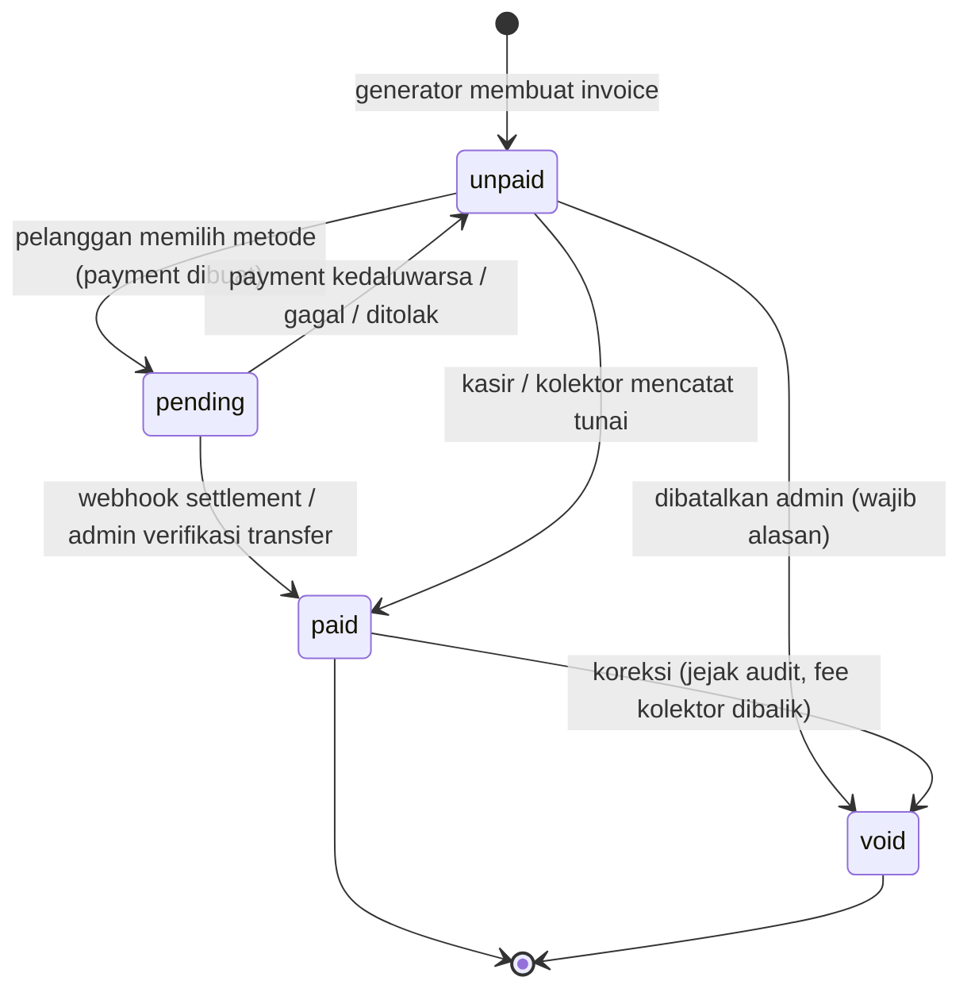

### 6.2 Payment

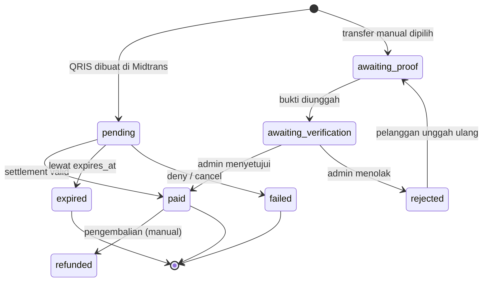

> Pada DDL §5.6 nilai `awaiting_proof` disimpan sebagai `pending` dengan `method='manual_transfer'` tanpa baris `payment_proofs`. Tambahkan nilai ini ke `CHECK` bila ingin eksplisit.

### 6.3 Pelanggan: status bisnis dan status jaringan dipisah

Dua kolom berbeda mencegah kekacauan ("pelanggan masih aktif secara kontrak tetapi internet sedang diisolir").

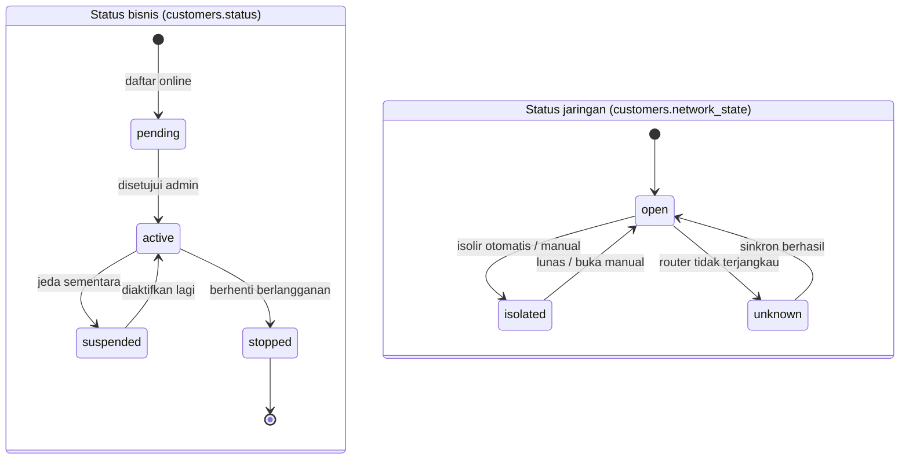

### 6.4 Pendaftaran online, tiket, tugas jaringan, pesan, order voucher

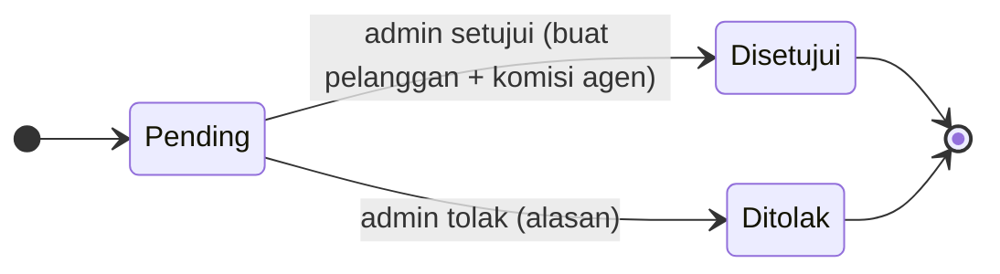

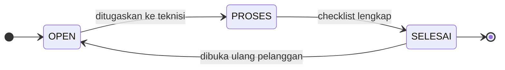

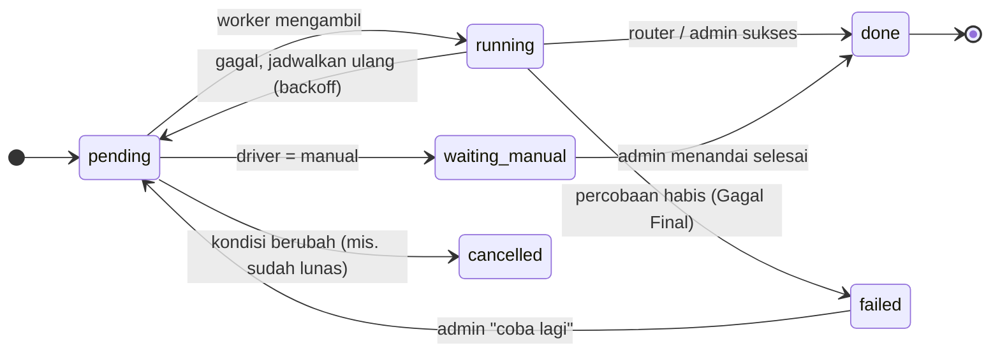

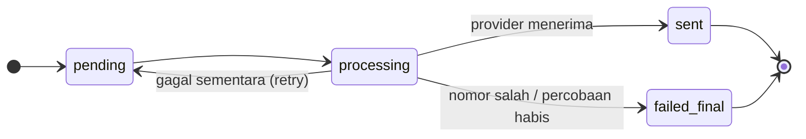

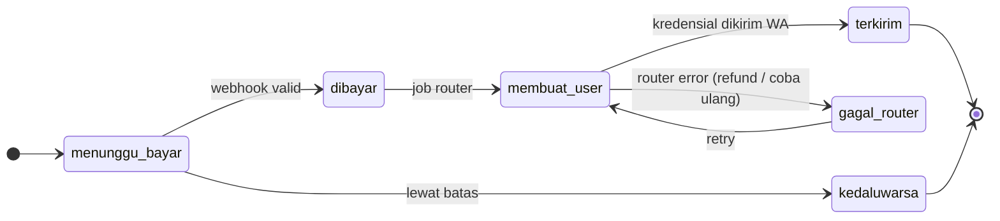

---

## 7. Aturan bisnis & perhitungan

### 7.1 Komponen tagihan

```
subtotal   = customers.custom_price ?? packages.base_price
tax        = round(subtotal × ppn_percent / 100)          // ppn dari pelanggan → paket → tenant
extra      = Σ charges_discounts (kind = 'charge',   status = open, cocok pelanggan/area/ODP/paket)
discount   = Σ charges_discounts (kind = 'discount', status = open, ...)
raw_total  = subtotal + tax + extra − discount
total      = pembulatan(raw_total, tenants.rounding_step)  // simpan selisihnya di rounding_amount
```

- Semua angka **bigint rupiah**. Jangan pakai `float`.
- Rincian disalin ke `invoice_items` (snapshot) supaya perubahan harga paket di masa depan tidak mengubah invoice lama.
- Biaya/diskon yang terpakai ditandai `status = closed` + `applied_at`.

### 7.2 Biaya admin gateway ditanggung pelanggan

Berlaku **hanya untuk pembayaran QRIS** (transfer manual dan tunai tidak ada biaya gateway). Biaya dihitung agar **ISP menerima nominal tagihan utuh** setelah dipotong Midtrans.

```
fee_bps       = basis point dari gateway_fee_rules (mis. 70 = 0,70 %)   ← PLACEHOLDER, cek kontrak
fee_flat      = biaya tetap per transaksi (bisa 0)
total_charged = ceil( (base_amount + fee_flat) × 10000 / (10000 − fee_bps) )
fee_amount    = total_charged − base_amount
```

Contoh (ilustrasi dengan 70 bps, flat 0): tagihan Rp 150.000 → `ceil(150000 × 10000 / 9930)` = **Rp 151.058**; biaya layanan Rp 1.058.

Aturan:
1. Pakai **integer math** (kalikan dulu, `intdiv` + cek sisa) untuk mencegah selisih pembulatan float.
2. Halaman bayar menampilkan **rincian jelas**: Tagihan + Biaya layanan pembayaran = Total bayar. Jangan disembunyikan.
3. `payments.gross_amount` yang dikirim ke Midtrans = `total_charged`. Webhook wajib dicek: `gross_amount` sama dengan `payments.total_charged`.
4. Tersedia pengaturan **`fee_bearer`** per akun gateway: `customer` (default sesuai keputusan Anda) atau `tenant`. Lihat catatan legal di §19.

### 7.3 Garis waktu tagihan dan warna notifikasi

Sesuai keputusan: **merah saat jatuh tempo**, **kuning saat masa tenggang**.

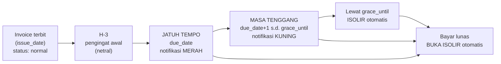

| Fase | Kondisi (dihitung, tidak disimpan) | Badge dashboard & halaman bayar | WhatsApp (template) |
|---|---|---|---|
| Normal | `today < due_date − 3` | abu / biru | `invoice_issued` saat terbit |
| Pengingat | `today = due_date − 3` | biru | `reminder_h3` |
| **Jatuh tempo** | `today = due_date` | **MERAH** | `due_red` ("jatuh tempo hari ini") |
| **Masa tenggang** | `due_date < today ≤ grace_until` | **KUNING** | `grace_yellow` (harian, batas isolir disebut) |
| Terisolir | `today > grace_until` dan belum lunas | merah tua + status "Terisolir" | `isolated` sekali saat isolir |
| Lunas | `status = paid` | hijau | `payment_success` + struk |

> **Catatan konfirmasi:** urutan umum di praktik biasanya *kuning dulu (menjelang jatuh tempo) lalu merah (menunggak)*. Saya menuruti kata-kata Anda apa adanya. Pemetaan fase → warna disimpan di `tenants.reminder_rules_json`, jadi membalik atau menambah fase **tidak butuh ubah kode**.

Aturan lain:
- `grace_until = due_date + grace_days`. `grace_days` berasal dari tenant, dapat ditimpa per pelanggan (`customers.grace_days_override`). Ini memenuhi aturan BRD-B "isolir mengikuti tanggal pelanggan, bukan sama untuk semua".
- Perubahan tanggal jatuh tempo oleh admin **menghitung ulang** `grace_until` dan **membatalkan** tugas isolir yang masih `pending`.

### 7.4 Prabayar dan pascabayar

| | Prabayar | Pascabayar |
|---|---|---|
| Invoice terbit | Sebelum periode mulai | Setelah periode berjalan / akhir periode |
| `due_date` | Awal periode | `due_day` bulan berikut |
| Belum bayar saat jatuh tempo | Isolir di awal periode (setelah grace) | Isolir setelah grace |

Pelanggan baru: tagihan pertama **penuh** atau **prorata** menurut pengaturan tenant (`first_invoice_mode`: `full` | `prorata`).

### 7.5 Aturan lain (turunan dari kedua BRD)

1. Pelanggan baru butuh minimal **1 paket**. Kasir butuh minimal **1 bank** (transfer manual) atau **1 gateway aktif**.
2. Pembayaran **lunas → buka isolir otomatis**; bila gagal → masuk antrean "Gagal Final" dan tampil di laporan Log Open Isolir.
3. Satu invoice hanya boleh punya **satu pembayaran `paid`** (dijaga unique index §5.6).
4. Pembatalan transaksi harus **membalik** fee kolektor (`collector_fee_ledger.entry_type = 'reversal'`).
5. Komisi agen **dibuat saat pendaftaran disetujui**, status `payable` setelah invoice pertama lunas.
6. Upgrade via aplikasi hanya jika: bukan pelanggan baru, belum upgrade di periode ini, layanan aktif, paket mengizinkan, bukan di akhir periode. Downgrade mengikuti pengaturan tenant.
7. Lisensi platform lewat jatuh tempo: peringatan bertahap → **suspend** (baca-saja, penagihan ke pelanggan tetap jalan agar tidak merugikan pelanggan akhir) → **arsip**. Data tidak dihapus instan.
8. Pesan WhatsApp gagal karena nomor salah tetap memotong kuota → **validasi dan normalisasi nomor** (`08…` → `628…`) sebelum antre.
9. NIK: simpan terenkripsi + hash HMAC untuk deteksi duplikat; tampil selalu ter-*mask*.

---

## 8. Flow chart & activity diagram

> Setiap diagram memakai *swimlane* (subgraph) per aktor atau sistem. Bentuk belah ketupat = keputusan.

### 8.1 Onboarding tenant (mitra baru) dan lisensi

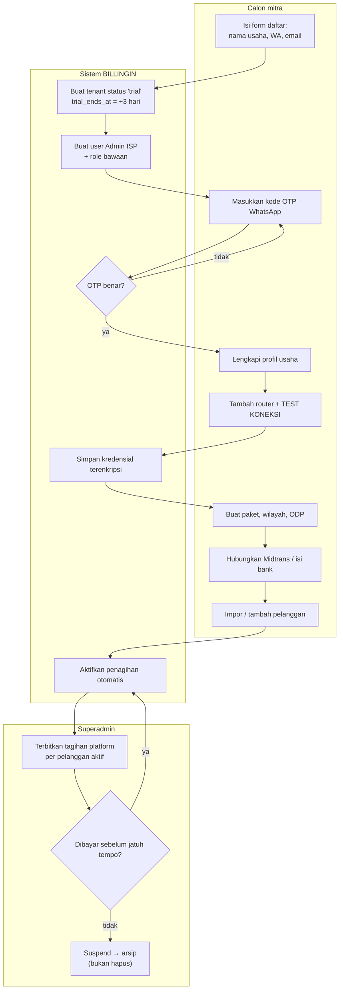

### 8.2 Pembuatan invoice otomatis (scheduler harian)

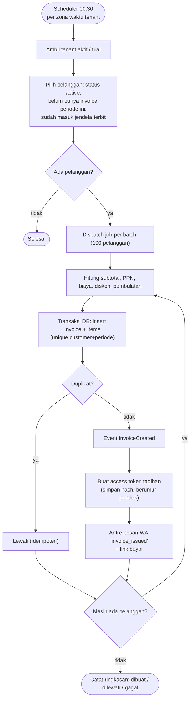

### 8.3 Pelanggan membayar via QRIS (activity)

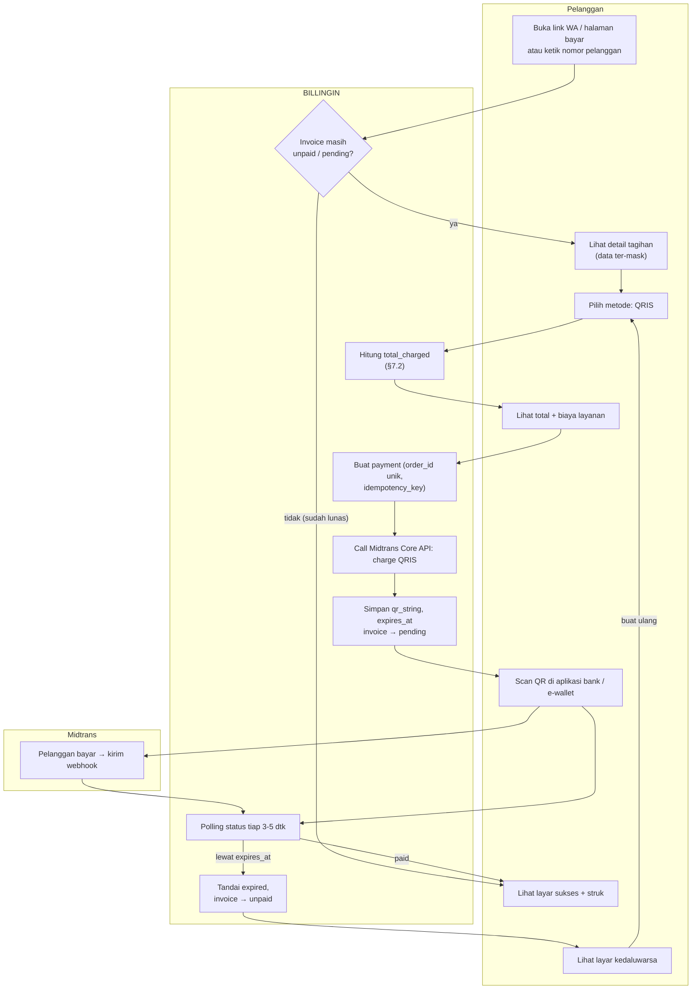

### 8.4 Pemrosesan webhook Midtrans (inti idempotensi)

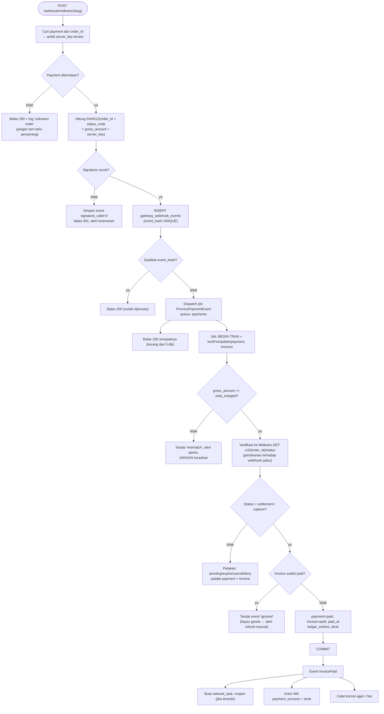

### 8.5 Transfer manual (verifikasi admin)

```mermaid
flowchart TD
    subgraph PL["Pelanggan"]
        A1["Pilih 'Transfer manual'"]
        A2["Lihat rekening ISP + nominal"]
        A3["Transfer di luar sistem"]
        A4["Unggah foto bukti + nama pengirim"]
        A5["Lihat status 'Menunggu verifikasi'"]
        A6["Terima WA lunas + struk"]
        A7["Terima WA ditolak + alasan"]
    end
    subgraph SYS["Sistem"]
        S1["Buat payment manual_transfer<br/>tanpa biaya gateway"]
        S2["Simpan file (storage privat),<br/>cek tipe & ukuran"]
        S3["Notifikasi ke Admin ISP / kasir"]
        S4["payment → paid<br/>invoice → paid<br/>buka isolir"]
    end
    subgraph AD["Admin ISP / kasir"]
        D1["Buka daftar 'Perlu verifikasi'"]
        D2{"Cocokkan mutasi bank<br/>nominal + nama + tanggal"}
        D3["Tolak + isi alasan"]
    end
    A1 --> S1 --> A2 --> A3 --> A4 --> S2 --> S3 --> A5 --> D1 --> D2
    D2 -- cocok --> S4 --> A6
    D2 -- tidak cocok --> D3 --> A7
    A7 -.-> A4
```

Opsi: aktifkan **kode unik** 1-999 rupiah pada nominal transfer manual agar mudah dicocokkan dengan mutasi (diatur per tenant).

### 8.6 Pembayaran tunai (kasir / kolektor), setoran, dan fee

```mermaid
flowchart TD
    subgraph KOL["Kolektor / kasir"]
        K1["Pilih pelanggan + invoice"]
        K2["Terima uang tunai"]
        K3["Cetak / kirim struk"]
        K4["Setor ke kantor"]
    end
    subgraph SYS["Sistem"]
        S1["payment method=cash<br/>collector_id, received_by"]
        S2["invoice → paid, buka isolir"]
        S3["Tambah collector_fee_ledger<br/>entry_type = accrual"]
        S4["Kewajiban setor = Σ tunai − Σ setoran"]
        S5["Catat settlements,<br/>kurangi kewajiban"]
    end
    subgraph ADM["Admin ISP"]
        A1["Terima uang setoran,<br/>konfirmasi"]
        A2["Bayar fee kolektor<br/>entry_type = paid"]
        A3["Batalkan transaksi (salah input)"]
        A4["Fee dibalik: entry_type = reversal"]
    end
    K1 --> K2 --> S1 --> S2 --> S3 --> K3
    S3 --> S4 --> K4 --> A1 --> S5
    S5 --> A2
    A3 --> A4
```

### 8.7 Isolir otomatis

```mermaid
flowchart TD
    T(["Scheduler 00:10 + tiap jam<br/>(per tenant)"]) --> Q["Cari invoice unpaid/pending<br/>dengan grace_until kurang dari hari ini<br/>dan customer.network_state = open"]
    Q --> G{"Jumlah kandidat lebih dari batas aman?<br/>(mis. lebih dari 20 % pelanggan tenant)"}
    G -- ya --> BR["BERHENTI + alert 'kemungkinan bug/<br/>router salah'; minta persetujuan admin"]
    G -- tidak --> DR{"Mode dry-run aktif?"}
    DR -- ya --> LOGD["Hanya catat daftar kandidat"]
    DR -- tidak --> NT["Buat network_task 'isolate'<br/>dedupe_key = isolate:cust:inv"]
    NT --> W["Worker (queue: network) ambil task"]
    W --> DRV{"Driver router?"}
    DRV -- mikrotik_pppoe --> A1["Disable secret ATAU ganti profile → 'isolir'"]
    A1 --> A2["Hapus sesi aktif (/ppp active remove)<br/>agar langsung terputus"]
    DRV -- manual --> M1["Status waiting_manual<br/>→ tampil di 'Antrean Aksi Manual'"]
    A2 --> OK{"Berhasil?"}
    OK -- ya --> UP["customers.network_state = isolated<br/>isolir_logs (success)<br/>WA 'isolated'"]
    OK -- tidak --> RT{"attempts kurang dari max?"}
    RT -- ya --> BO["Jadwalkan ulang (backoff 1m, 5m, 15m, 1j, 6j)"]
    BO --> W
    RT -- tidak --> FF["status = failed (Gagal Final)<br/>isolir_logs (error) + alert admin"]
    M1 --> MD["Admin kerjakan manual lalu tekan 'Selesai'"]
    MD --> UP
```

### 8.8 Buka isolir setelah bayar

```mermaid
flowchart TD
    E(["Event InvoicePaid"]) --> C{"customer.network_state = isolated?"}
    C -- tidak --> Z(["Selesai"])
    C -- ya --> X{"Masih ada invoice lain<br/>yang lewat grace_until?"}
    X -- ya --> KEEP["Tetap isolir<br/>(kirim WA: masih ada tunggakan)"]
    X -- tidak --> CAN["Batalkan task 'isolate' yang masih pending"]
    CAN --> NT["Buat network_task 'reopen'<br/>prioritas tinggi"]
    NT --> W["Worker jalankan lewat driver"]
    W --> R{"Sukses?"}
    R -- ya --> UP["network_state = open<br/>isolir_logs (reopen)<br/>WA: internet aktif kembali"]
    R -- tidak --> RT["Retry + backoff"]
    RT -->|"gagal final"| LG["Masuk 'Log Open Isolir' + alert<br/>(target SLA: ≤ 60 detik sukses,<br/>≤ 5 menit sesuai BRD-A)"]
```

### 8.9 Pendaftaran pelanggan online

```mermaid
flowchart TD
    subgraph CALON["Calon pelanggan"]
        A1["Buka form (web / app)"]
        A2["Isi nama, HP, NIK, alamat,<br/>pilih paket 'pendaftaran online', pin lokasi"]
        A3["Verifikasi OTP WhatsApp"]
        A4["Terima WA bukti pendaftaran"]
        A5["Terima WA disetujui / ditolak"]
    end
    subgraph SYS["Sistem"]
        S1{"Pendaftaran online<br/>diizinkan tenant?"}
        S2{"Lokasi dalam radius<br/>kantor (≤ 50 km)?"}
        S3["Simpan registrations = Pending<br/>NIK terenkripsi + hash"]
        S4["Buat pelanggan (pending→active),<br/>akun PPPoE, invoice pertama,<br/>komisi agen (jika referal)"]
    end
    subgraph ADM["Admin ISP"]
        D1["Tinjau antrian Pending"]
        D2{"Setujui?"}
        D3["Tolak + alasan"]
    end
    A1 --> S1
    S1 -- tidak --> X1(["Tampilkan: pendaftaran ditutup"])
    S1 -- ya --> A2 --> A3 --> S2
    S2 -- tidak --> X2(["Tolak: di luar jangkauan"])
    S2 -- ya --> S3 --> A4 --> D1 --> D2
    D2 -- ya --> S4 --> A5
    D2 -- tidak --> D3 --> A5
```

### 8.10 Pembelian voucher hotspot

```mermaid
flowchart TD
    subgraph PV["Pembeli"]
        A1["Buka toko voucher ISP"]
        A2["Pilih produk + jumlah, isi nomor WA"]
        A3["Bayar QRIS"]
        A4["Terima kode voucher via WA<br/>+ tampil di layar"]
    end
    subgraph SYS["Sistem"]
        S1["Buat voucher_order + payment QRIS<br/>(biaya gateway ikut §7.2)"]
        S2["Webhook settlement valid"]
        S3["Job 'create_voucher' ke router<br/>/ip hotspot user add ..."]
        S4{"Berhasil di router?"}
        S5["Simpan vouchers + kirim WA"]
        S6["Retry; bila gagal final → refund manual<br/>+ alert admin"]
    end
    A1 --> A2 --> S1 --> A3 --> S2 --> S3 --> S4
    S4 -- ya --> S5 --> A4
    S4 -- tidak --> S6
```

### 8.11 Tiket komplain

```mermaid
flowchart TD
    subgraph SRC["Sumber"]
        P1["Pelanggan: app / web / bot WA"]
        P2["Admin: buat manual"]
    end
    subgraph SYS["Sistem"]
        S1["Buat tiket + kode unik, status OPEN"]
        S2["WA ke pelanggan: tiket diterima"]
        S3["Update status + catat ticket_updates"]
        S4["WA progres ke pelanggan"]
    end
    subgraph ADM["Admin / teknisi"]
        A1["Tugaskan ke teknisi (Action Team)"]
        A2["Status PROSES + isi checklist"]
        A3{"Semua checklist selesai?"}
        A4["Status SELESAI + catatan"]
    end
    P1 --> S1
    P2 --> S1
    S1 --> S2 --> A1 --> A2 --> S3 --> S4
    S4 --> A3
    A3 -- belum --> A2
    A3 -- ya --> A4 --> S3
```

### 8.12 Ganti paket (upgrade / downgrade)

```mermaid
flowchart TD
    A(["Pelanggan di app minta ganti paket"]) --> B{"Memenuhi syarat?<br/>(bukan baru, belum upgrade periode ini,<br/>layanan aktif, paket mengizinkan)"}
    B -- tidak --> X["Tolak + tampilkan alasan"]
    B -- ya --> C{"Upgrade atau downgrade?"}
    C -- upgrade --> U["Hitung selisih prorata<br/>buat invoice tambahan"]
    U --> P["Pelanggan bayar"]
    P --> E["Efektif: update package_id"]
    C -- downgrade --> D{"Tenant mengizinkan downgrade?"}
    D -- tidak --> X
    D -- ya --> F["Efektif di awal periode berikutnya"]
    E --> N["network_task 'update_profile'<br/>+ hapus sesi aktif agar profil baru berlaku"]
    F --> N
    N --> L["Catat package_changes + WA konfirmasi"]
```

### 8.13 Impor pelanggan dari Excel

```mermaid
flowchart TD
    A(["Admin unggah .xlsx / .csv"]) --> B{"Baris ≤ 500?"}
    B -- tidak --> X["Tolak: pecah file"]
    B -- ya --> C["Baca ke tabel staging<br/>(import_rows)"]
    C --> D["Validasi per baris:<br/>paket ada, ODP ada, HP valid,<br/>username PPPoE unik, ODP masih punya slot"]
    D --> E{"Ada baris salah?"}
    E -- ya --> R["Tampilkan laporan per baris<br/>+ unduh CSV baris gagal"]
    E -- tidak --> OKB["Konfirmasi impor"]
    R --> OPT{"Lanjut hanya baris valid?"}
    OPT -- ya --> OKB
    OPT -- tidak --> END1(["Batal"])
    OKB --> G["Transaksi: insert pelanggan"]
    G --> H["Queue: buat PPP secret di router<br/>(network_task create_secret)"]
    H --> I["Ringkasan: berhasil / gagal / menunggu router"]
```

### 8.14 Cek sinkron database ↔ MikroTik

```mermaid
flowchart TD
    A(["Admin pilih router → Cek Sinkron"]) --> B["Ambil /ppp secret dari router<br/>(job queue, read-only)"]
    B --> C["Bandingkan dengan customers di DB"]
    C --> D["Hasil: hanya di DB, hanya di router,<br/>beda profile, beda status disabled"]
    D --> E["Simpan sync_audits + items,<br/>tampil + ekspor CSV"]
    E --> F{"Admin pilih tindakan per baris"}
    F --> G["Buat di router (create_secret)"]
    F --> H["Impor ke DB (buat pelanggan draf)"]
    F --> I["Perbaiki profile / disabled"]
    F --> J["Abaikan"]
    G --> K["Tidak ada perubahan otomatis tanpa konfirmasi"]
    H --> K
    I --> K
```

---

## 9. Sequence diagram integrasi

### 9.1 Pembayaran QRIS end-to-end

```mermaid
sequenceDiagram
    autonumber
    actor P as Pelanggan
    participant FE as Halaman bayar (PWA)
    participant API as Laravel API
    participant DB as SQL Server
    participant MD as Midtrans
    participant Q as Queue worker
    participant R as MikroTik
    participant WA as WhatsApp

    P->>FE: Buka link tagihan (token)
    FE->>API: GET /pay/{token}
    API->>DB: validasi token + muat invoice
    API-->>FE: tagihan (data ter-mask)
    P->>FE: Pilih QRIS
    FE->>API: POST /pay/{token}/qris (Idempotency-Key)
    API->>DB: buat payment pending, hitung total_charged
    API->>MD: POST /v2/charge (qris, order_id, gross_amount)
    MD-->>API: qr_string, expiry
    API->>DB: simpan qr, invoice=pending
    API-->>FE: QR + timer + rincian biaya
    P->>MD: Scan & bayar via bank / e-wallet
    MD-->>API: POST /webhook/midtrans/{slug}
    API->>API: verifikasi signature + event_hash unik
    API-->>MD: 200 OK (cepat)
    API->>Q: ProcessPaymentEvent
    Q->>MD: GET /v2/{order_id}/status (verifikasi)
    Q->>DB: TRAN: payment=paid, invoice=paid, ledger
    Q->>Q: dispatch reopen + kirim struk
    Q->>R: aktifkan kembali PPPoE (jika terisolir)
    Q->>WA: kirim "Pembayaran berhasil" + struk
    FE->>API: polling status tiap 3-5 detik
    API-->>FE: paid
    FE-->>P: Layar sukses + struk
```

### 9.2 Isolir dengan driver dan retry

```mermaid
sequenceDiagram
    autonumber
    participant S as Scheduler
    participant DB as SQL Server
    participant Q as Worker (queue network)
    participant D as NetworkDriver
    participant R as Router MikroTik
    participant WA as WhatsApp
    actor A as Admin ISP

    S->>DB: cari invoice lewat grace_until
    S->>DB: insert network_tasks (dedupe_key)
    Q->>DB: ambil task pending (lock)
    Q->>D: isolate(customer)
    alt driver = mikrotik_pppoe
        D->>R: /ppp secret set disabled=yes
        D->>R: /ppp active remove
        R-->>D: OK
        D-->>Q: sukses
        Q->>DB: network_state=isolated, isolir_logs
        Q->>WA: antre pesan 'isolated'
    else router tidak terjangkau
        D-->>Q: gagal (timeout)
        Q->>DB: attempts+1, next_attempt_at (backoff)
        Note over Q,DB: percobaan habis → status failed (Gagal Final)
        Q->>A: alert + tampil di Log Open/Isolir
    else driver = manual
        D-->>Q: waiting_manual
        Q->>A: tampil di Antrean Aksi Manual
        A->>DB: tekan 'Selesai' → done
    end
```

### 9.3 Login pelanggan dengan OTP WhatsApp

```mermaid
sequenceDiagram
    autonumber
    actor P as Pelanggan
    participant FE as App / Web
    participant API as Laravel API
    participant C as Redis
    participant Q as Queue
    participant WA as WhatsApp

    P->>FE: Masukkan nomor HP
    FE->>API: POST /auth/otp/request (rate-limit)
    API->>API: cari pelanggan dari hash HP (semua tenant → pilih tenant)
    API->>C: simpan hash OTP, TTL 5 menit, batas percobaan
    API->>Q: antre pesan OTP (category = otp, prioritas tinggi)
    Q->>WA: kirim OTP
    P->>FE: Masukkan OTP
    FE->>API: POST /auth/otp/verify
    API->>C: cocokkan hash, hapus bila benar
    API-->>FE: token Sanctum (guard customer)
```

---

## 10. Desain modul jaringan (MikroTik driver)

### 10.1 Prinsip

1. **Tidak ada kode MikroTik di luar modul `Network`.** Modul lain hanya membuat `network_task`.
2. Jaringan dikendalikan lewat **antrian perintah** (`network_tasks`), bukan dipanggil langsung dari request web. Router offline tidak boleh membuat halaman bayar lambat atau gagal.
3. Driver dipilih **per router** (`routers.network_driver`). Mengganti driver tidak menyentuh logika bisnis.

### 10.2 Kontrak driver

```php
interface NetworkDriver
{
    public function testConnection(Router $router): ConnectionResult;

    public function createAccount(Customer $c): TaskResult;        // PPP secret
    public function updateProfile(Customer $c, string $profile): TaskResult;
    public function isolate(Customer $c): TaskResult;
    public function reopen(Customer $c): TaskResult;
    public function removeAccount(Customer $c): TaskResult;

    public function listAccounts(Router $router): iterable;        // untuk Cek Sinkron
    public function createHotspotUser(VoucherSpec $v): TaskResult;  // voucher

    public function capabilities(): array;   // ['live_status', 'kick_session', ...]
}
```

| Driver | Perilaku | Kapan dipakai |
|---|---|---|
| `mikrotik_pppoe` | RouterOS API: `/ppp secret`, `/ppp active`, `/ip hotspot user` | Router terjangkau lewat VPN |
| `manual` | Tidak menyentuh router. Task jadi `waiting_manual`; admin mengerjakan lalu menekan "Selesai" | Router belum tersambung / ISP belum percaya otomatisasi |
| *(masa depan)* `radius` / `mikrotik_hotspot` / `ubiquiti` | Implementasi interface yang sama | Jika kontrol berubah di tengah jalan |

### 10.3 Perintah RouterOS yang dipakai (acuan)

| Aksi | Perintah (RouterOS API / CLI) |
|---|---|
| Isolir mode **Disable secret** | `/ppp secret set [find name=USER] disabled=yes` lalu `/ppp active remove [find name=USER]` |
| Isolir mode **Ubah profile** | `/ppp secret set [find name=USER] profile=PROFILE_ISOLIR` lalu `/ppp active remove [find name=USER]` |
| Buka isolir | kebalikannya: `disabled=no` atau `profile=<profile paket>` + `/ppp active remove` |
| Buat akun | `/ppp secret add name=USER password=PASS profile=PROFILE service=pppoe` |
| Voucher hotspot | `/ip hotspot user add name=U password=P profile=PRF server=SRV limit-uptime=.. limit-bytes-total=..` |

Catatan penting:
- Tanpa menghapus **sesi aktif**, pelanggan yang sedang online tidak langsung terisolir. Karena itu langkah `active remove` wajib.
- Mode **Ubah profile** butuh profile `isolir` di router (rate-limit kecil + redirect ke halaman isolir lewat address-list/NAT/walled garden). Skrip pengaturan awal disediakan di wizard tambah router (BRD-B §5.9).
- Sintaks berbeda sedikit antara RouterOS 6 dan 7. Driver mendeteksi versi (`routers.routeros_version`) dan memakai template per versi.

### 10.4 Pengaman operasional

| Pengaman | Aturan |
|---|---|
| Batas massal | Bila kandidat isolir > ambang (default **20 % pelanggan tenant**) → **berhenti + alert**, perlu persetujuan admin |
| Dry-run | Mode uji: catat siapa yang akan diisolir tanpa mengeksekusi |
| Idempotensi | `dedupe_key` unik pada task aktif; menjalankan dua kali tidak berefek ganda |
| Pembatalan | Invoice lunas → task `isolate` yang `pending` dibatalkan |
| Backoff | 1 menit, 5 menit, 15 menit, 1 jam, 6 jam, 24 jam, lalu **Gagal Final** |
| Circuit breaker | Router gagal berturut-turut → status `offline`, task menunggu, tidak membanjiri router |
| Konkurensi | Maks. 1 koneksi API per router pada satu waktu (lock Redis per `router_id`) |
| Hak minimum | Buat user API khusus di router dengan hak sebatas `/ppp` dan `/ip hotspot`; batasi `address` ke IP server/VPN |
| Kredensial | `api_username_enc`, `api_password_enc` memakai `Crypt`; **tidak pernah ditampilkan ulang** |
| Audit | Semua aksi tercatat di `isolir_logs` dan `audit_logs` (siapa/apa, kapan, hasil) |

### 10.5 Cara berpindah driver di tengah jalan

1. Ubah `routers.network_driver` (mis. `manual` → `mikrotik_pppoe`).
2. Task `waiting_manual` yang belum selesai ditandai ulang `pending` (admin konfirmasi).
3. Jalankan **Cek Sinkron** (§8.14) untuk menyamakan DB dan router sebelum mengaktifkan isolir otomatis.
4. Aktifkan **dry-run** satu siklus, lalu matikan.

---

## 11. Integrasi Midtrans

> Rincian endpoint, field, dan nilai di bawah adalah ringkasan kerja. **Verifikasi ke dokumentasi Midtrans terbaru** (docs.midtrans.com) saat implementasi, terutama parameter QRIS dan jadwal settlement.

### 11.1 Skema akun

- **Default (asumsi A1):** tiap ISP punya akun merchant Midtrans sendiri. `Client Key` dan `Server Key` disimpan di `gateway_accounts` **terenkripsi**, dengan tombol **TEST KONEKSI** sebelum diaktifkan.
- Karena kunci per tenant, **URL notifikasi per tenant**: `https://api.billingin.id/webhook/midtrans/{tenant_slug}` (didaftarkan di dashboard Midtrans tiap ISP).
- Tagihan platform ke mitra memakai akun Midtrans milik **platform** (`scope = platform`).

### 11.2 Pembuatan transaksi QRIS

| Item | Nilai |
|---|---|
| Endpoint (Core API) | `POST https://api.sandbox.midtrans.com/v2/charge` (sandbox) dan `https://api.midtrans.com/v2/charge` (produksi) |
| Auth | HTTP Basic: `base64(ServerKey + ":")` |
| Body | `payment_type: "qris"`, `transaction_details: { order_id, gross_amount }`, `customer_details`, `item_details` (tagihan + biaya layanan), masa berlaku (custom expiry) |
| `order_id` | Unik, **maks. 50 karakter**: `BIL-{tenantId}-{invoiceId}-{attempt}-{rand4}` |
| `gross_amount` | = `payments.total_charged` (§7.2), bilangan bulat |
| Respons dipakai | `qr_string` / URL gambar QR, `transaction_id`, `expiry_time` |

Masa berlaku QRIS dibuat konfigurasi (mis. 30 menit) dan ditampilkan sebagai timer di layar QRIS.

### 11.3 Verifikasi notifikasi (webhook)

```
signature_key = SHA512( order_id + status_code + gross_amount + ServerKey )
```

Cek berlapis (semua wajib):

1. **Signature** cocok (bandingkan dengan `hash_equals`).
2. `order_id` dikenal dan milik tenant pada URL.
3. `gross_amount` (string, mis. `"151058.00"`) setelah dinormalisasi **sama** dengan `payments.total_charged`.
4. **Konfirmasi balik**: `GET /v2/{order_id}/status` memakai server key tenant. Jangan percaya isi webhook saja.
5. **Idempotensi**: `event_hash` unik; baris `payments` dan `invoices` dikunci (`lockForUpdate`) di dalam transaksi.
6. Balas `200` cepat; pekerjaan berat lewat queue.

### 11.4 Pemetaan status Midtrans → status internal

| `transaction_status` | Aksi pada `payments` | Aksi pada `invoices` |
|---|---|---|
| `pending` | tetap `pending` | tetap `pending` |
| `settlement` (juga `capture` untuk kartu) | `paid` | `paid` + buka isolir |
| `expire` | `expired` | kembali `unpaid` |
| `cancel` / `deny` | `failed` | kembali `unpaid` |
| `refund` / `partial_refund` | `refunded` + alert admin | tinjau manual |

### 11.5 Cadangan bila webhook gagal

| Mekanisme | Jadwal |
|---|---|
| Polling dari halaman bayar | tiap 3-5 detik selama layar QRIS terbuka |
| Job rekonsiliasi payment `pending` (cek `GET /status`) | tiap 5 menit |
| Job kedaluwarsa (`expires_at` lewat → cek status final → `expired`) | tiap menit |
| Rekonsiliasi harian vs laporan Midtrans | 02:00 (selisih → laporan + alert) |

### 11.6 Abstraksi supaya gateway bisa ditambah

```php
interface PaymentGateway
{
    public function charge(Payment $p, GatewayAccount $acc): ChargeResult;
    public function status(Payment $p, GatewayAccount $acc): GatewayStatus;
    public function verifyWebhook(Request $r, GatewayAccount $acc): VerifiedEvent;
    public function cancel(Payment $p, GatewayAccount $acc): void;
}
// Implementasi awal: MidtransGateway. VA & minimarket (BRD-A) bisa menyusul tanpa ubah alur bisnis.
```

---

## 12. Notifikasi WhatsApp

### 12.1 Arsitektur

`Event → Listener → MessageComposer (template + variabel) → insert messages (pending, dedupe_key) → worker kirim lewat driver → status sent / failed → webhook status (opsional)`.

### 12.2 Template bawaan

| Kode | Pemicu | Isi utama | Warna |
|---|---|---|---|
| `invoice_issued` | Invoice terbit | nama, periode, total, jatuh tempo, link bayar | netral |
| `reminder_h3` | H-3 | pengingat + link | netral |
| `due_red` | Hari jatuh tempo | "jatuh tempo **hari ini**", link | **merah** |
| `grace_yellow` | Masa tenggang (harian) | "batas sebelum isolir: {tanggal}", link | **kuning** |
| `isolated` | Setelah isolir | pemberitahuan + link bayar | merah tua |
| `payment_success` | Lunas | konfirmasi + struk (PDF/link) | hijau |
| `reopened` | Internet aktif kembali | konfirmasi | hijau |
| `registration_received` / `approved` / `rejected` | Pendaftaran | bukti, hasil | netral |
| `otp_login` | Login pelanggan | kode OTP | netral |
| `voucher_delivery` | Voucher dibayar | kode voucher | netral |
| `ticket_update` | Perubahan tiket | status terbaru | netral |
| `license_reminder` | Tagihan platform | untuk Admin ISP | kuning/merah |

Variabel: `{nama}`, `{kode_pelanggan}`, `{nomor_tagihan}`, `{periode}`, `{total}`, `{jatuh_tempo}`, `{batas_isolir}`, `{link_bayar}`, `{nama_usaha}`.

### 12.3 Aturan pengiriman

| Aturan | Rincian |
|---|---|
| Normalisasi nomor | `08xx` → `628xx`; tolak yang tidak valid sebelum antre |
| Idempotensi | `dedupe_key = template:customer:invoice:tanggal` → tidak kirim dobel |
| Jeda kirim | `message_senders.send_gap_seconds` (rentang 1 detik sampai 5 menit; BRD-B menyebut jeda 1-5 menit) |
| Prioritas | OTP dan `payment_success` di queue prioritas |
| Retry | gagal sementara → retry berjenjang; nomor tidak valid → `failed_final` tanpa retry |
| Kuota | Mode prabayar: kurangi `message_quota_ledger` saat kirim (nomor salah tetap memotong → validasi dulu) |
| Peringatan | Dashboard menampilkan peringatan bila **semua pengirim nonaktif** (BRD-B FR-MSG) |
| Fallback | Bila WA gagal final untuk pesan penting → fallback email/SMS (opsional, tahap berikut) |
| Opt-out | Pelanggan dapat berhenti dari pesan promosi; pesan transaksional tetap dikirim |
| Risiko blokir | Gunakan provider resmi bila bisa, template baku, batasi laju, hindari pesan massal ke nomor yang tak pernah membalas |

### 12.4 Kontrak driver WA

```php
interface WhatsAppDriver
{
    public function send(Message $m, MessageSender $s): SendResult;       // mengembalikan provider_message_id
    public function checkNumber(string $e164, MessageSender $s): bool;    // opsional
    public function parseDeliveryWebhook(Request $r): ?DeliveryUpdate;    // opsional
}
```

---

## 13. Rancangan API (route)

Versi: `/api/v1`. Format JSON. Error mengikuti `application/problem+json` (RFC 7807). Pagination kursor/halaman. Semua `POST` pembayaran wajib header `Idempotency-Key`.

### 13.1 Publik (tanpa login, rate-limited, data ter-mask)

| Method | Path | Fungsi |
|---|---|---|
| GET | `/{slug}/bill?customer_code=` atau `?phone=` | Cek tagihan (hasil ter-mask, mengembalikan token tagihan) |
| GET | `/pay/{token}` | Detail tagihan |
| POST | `/pay/{token}/qris` | Buat QRIS |
| GET | `/pay/{token}/status` | Polling status |
| POST | `/pay/{token}/manual` | Mulai transfer manual |
| POST | `/pay/{token}/manual/proof` | Unggah bukti |
| GET | `/pay/{token}/receipt` | Struk PDF (jika lunas) |
| GET | `/{slug}/packages` | Paket yang boleh daftar online |
| POST | `/{slug}/registrations` | Daftar online |
| GET | `/{slug}/voucher-products` | Produk voucher |
| POST | `/{slug}/voucher-orders` | Pesan voucher (+ QRIS) |
| GET | `/{slug}/faq` | FAQ / bantuan |

Masking: nama `Wa**** Pr****`, HP `0812****34`, alamat hanya kelurahan/kota, NIK tidak pernah tampil.

### 13.2 Pelanggan (guard `customer`)

| Method | Path | Fungsi |
|---|---|---|
| POST | `/auth/otp/request` · `/auth/otp/verify` | Login OTP WhatsApp |
| GET | `/me` | Profil, paket, status layanan |
| GET | `/me/invoices` · `/me/payments` | Tagihan & riwayat |
| POST | `/me/package-change` | Ajukan upgrade/downgrade |
| GET/POST | `/me/tickets` · `/me/tickets/{id}` | Tiket komplain |
| POST | `/me/wifi-settings` | Ganti SSID/password (tahap ACS) |
| POST | `/me/devices` | Daftar token push |
| GET | `/me/notifications` | Notifikasi dalam aplikasi |

### 13.3 Admin ISP dan role kustom (guard `web`, ber-scope tenant)

| Grup | Path (resource) | Catatan |
|---|---|---|
| Profil usaha | `GET/PUT /admin/settings` | identitas, PPN, pembulatan, jatuh tempo, tenggang, radius daftar |
| Master | `/admin/areas` · `/admin/odps` · `/admin/packages` · `/admin/banks` | CRUD |
| Router | `/admin/routers` · `POST /admin/routers/{id}/test` · `POST /admin/routers/{id}/driver` | tombol TEST KONEKSI, ganti driver |
| Pelanggan | `/admin/customers` · `POST /admin/customers/import` · `POST /admin/customers/{id}/isolate\|reopen` | impor, aksi manual |
| Sinkron | `POST /admin/routers/{id}/sync-audit` · `GET /admin/sync-audits/{id}` | Cek Sinkron |
| Tagihan | `/admin/invoices` · `POST /admin/invoices/{id}/void` · `GET /admin/invoices/unpaid` | |
| Bayar | `POST /admin/payments` (tunai/transfer) · `POST /admin/payments/{id}/verify` · `/reject` · `/void` | |
| Biaya & diskon | `/admin/charges-discounts` | |
| Kolektor | `/admin/collectors` · `/admin/settlements` · `/admin/collectors/{id}/fee-ledger` | |
| Pendaftaran | `/admin/registrations` · `POST …/{id}/approve\|reject` | |
| Tiket | `/admin/tickets` · `POST …/{id}/assign\|update` | |
| Voucher | `/admin/voucher-products` · `/admin/voucher-orders` · `/admin/vouchers` | |
| Pesan | `/admin/messages` · `/admin/message-templates` · `/admin/message-senders` · `POST /admin/messages/broadcast` | |
| Aksi manual | `/admin/network-tasks` · `POST …/{id}/done\|retry` | antrean aksi manual & gagal final |
| Laporan | `GET /admin/reports/{mutasi\|omset\|laba-rugi\|unpaid\|isolir\|open-isolir\|voucher\|payment-online\|ganti-paket\|komisi}` | filter + `?export=csv\|xlsx` |
| Karyawan | `/admin/staff` · `/admin/roles` · `/admin/login-histories` | |
| Gateway | `PUT /admin/gateway` · `POST /admin/gateway/test` | simpan kunci Midtrans terenkripsi |
| Agen | `/admin/agents` · `/admin/agent-commissions` | |
| ONT | `/admin/onts` · `POST /admin/onts/{id}/reboot` | tahap akhir |

### 13.4 Superadmin (Anda)

| Path | Fungsi |
|---|---|
| `/super/tenants` | daftar, suspend, aktifkan, arsipkan |
| `/super/tenants/{id}/impersonate` | masuk sebagai tenant (**wajib alasan + audit**) |
| `/super/licenses` · `/super/platform-invoices` | lisensi dan tagihan platform |
| `/super/addons` · `/super/tenants/{id}/addons` | katalog dan aktivasi add-on |
| `/super/gateway-fee-rules` | konfigurasi tarif biaya gateway |
| `/super/queues` | status Horizon, job gagal |
| `/super/health` | kesehatan router, webhook, antrean, pesan |

### 13.5 Webhook masuk

| Path | Sumber |
|---|---|
| `POST /webhook/midtrans/{tenantSlug}` | Notifikasi Midtrans per tenant |
| `POST /webhook/midtrans/platform` | Pembayaran tagihan platform |
| `POST /webhook/whatsapp/{driver}` | Status kirim WA (bila provider mendukung) |

---

## 14. Scheduler & queue job

| Job / jadwal | Frekuensi | Queue | Keterangan |
|---|---|---|---|
| `GenerateInvoices` | harian 00:30 (zona waktu tenant) | default | idempoten (unique customer+periode) |
| `SendReminders` | harian 08:00 | messages | H-3, jatuh tempo (merah), masa tenggang (kuning) |
| `EvaluateIsolir` | harian 00:10 + tiap jam | network | batas massal + dry-run (§10.4) |
| `ProcessNetworkTasks` | tiap menit | network | retry sesuai backoff |
| `ExpirePayments` | tiap menit | payments | cek status final sebelum menandai expired |
| `ReconcilePending` | tiap 5 menit | payments | cek `GET /status` untuk payment pending |
| `DailyGatewayReconciliation` | harian 02:00 | payments | bandingkan dengan laporan Midtrans |
| `DispatchMessages` | tiap menit | messages | hormati jeda kirim per pengirim |
| `PlatformBilling` | harian | default | hitung pelanggan aktif, terbitkan tagihan platform, suspend/arsip |
| `SyncRouterHealth` | tiap 5 menit | network | uji koneksi, update `last_seen_at`, circuit breaker |
| `AcsPoll` (tahap akhir) | tiap 5–15 menit | network | tarik status ONT |
| `PruneAndArchive` | mingguan | default | arsip `audit_logs`, `messages`, `webhook_events` lama |
| Backup DB | harian (di luar Laravel) | — | uji restore bulanan |

Pengaturan Horizon (usulan): `payments` (min 3 worker, prioritas tertinggi), `network` (2, dibatasi per router), `messages` (2), `default` (2). Semua job `ShouldBeUnique` / punya `dedupe_key` bila relevan, dan membawa `tenant_id`.

---

## 15. Keamanan, audit, dan privasi

| Area | Kontrol |
|---|---|
| Transport | HTTPS wajib, HSTS; header keamanan di nginx |
| Autentikasi | Password hash (Argon2id/bcrypt), 2FA untuk Superadmin dan Admin ISP, kunci akun setelah gagal berulang, histori login |
| Otorisasi | RBAC per permission + scope tenant (global scope + RLS). Policy Laravel di tiap resource |
| Kredensial | Router, kunci Midtrans, kredensial WA, NIK: `Crypt` (APP_KEY) atau envelope encryption; **tidak pernah dikirim balik ke frontend**; rotasi `APP_KEY` didukung lewat re-enkripsi |
| Webhook | Signature + konfirmasi balik + idempotensi + cek nominal |
| Halaman publik | Rate limit per IP dan per nomor, captcha setelah N percobaan, token tagihan acak 256 bit disimpan sebagai **hash**, kedaluwarsa pendek, **tanpa user enumeration** (pesan sama untuk "tidak ditemukan" dan "tidak berhak") |
| Unggahan | Bukti transfer di storage **privat**, validasi MIME dan ukuran, nama acak, URL bertanda tangan berumur pendek, pemindaian virus bila memungkinkan |
| Audit | `audit_logs` untuk semua perubahan finansial, isolir, perubahan kredensial, impersonasi (siapa, kapan, sebelum/sesudah) |
| Privasi (UU PDP) | Minimisasi data, masking di UI publik, retensi (arsip → hapus sesuai kebijakan), ekspor data tenant, catat dasar pemrosesan dan persetujuan di form pendaftaran |
| OWASP Top 10 | Validasi input (FormRequest), query berparameter (Eloquent), proteksi CSRF, escaping output, dependensi dipindai (`composer audit`, Dependabot) |
| Rahasia | `.env` tidak masuk git; di produksi pakai Docker secrets / vault |
| Pemisahan | Webhook dan halaman bayar publik di route group dengan middleware ketat (tanpa session) |
| Observabilitas | Log JSON terstruktur (`tenant_id`, `request_id`, `order_id`), alert: webhook gagal/signature palsu, Gagal Final isolir, router offline, antrean menumpuk, selisih rekonsiliasi |

---

## 16. Deployment Docker

### 16.1 Dockerfile (ringkas, PHP-FPM + driver SQL Server)

```dockerfile
FROM php:8.3-fpm-bookworm AS base   # sesuaikan versi PHP dengan Laravel + pdo_sqlsrv yang dipakai

RUN apt-get update && apt-get install -y --no-install-recommends \
      gnupg2 curl ca-certificates unixodbc-dev libzip-dev unzip git \
 && curl -fsSL https://packages.microsoft.com/keys/microsoft.asc \
      | gpg --dearmor -o /usr/share/keyrings/microsoft-prod.gpg \
 && echo "deb [arch=amd64 signed-by=/usr/share/keyrings/microsoft-prod.gpg] https://packages.microsoft.com/debian/12/prod bookworm main" \
      > /etc/apt/sources.list.d/mssql-release.list \
 && apt-get update && ACCEPT_EULA=Y apt-get install -y msodbcsql18 \
 && pecl install sqlsrv pdo_sqlsrv \
 && docker-php-ext-enable sqlsrv pdo_sqlsrv \
 && docker-php-ext-install pcntl bcmath zip opcache \
 && pecl install redis && docker-php-ext-enable redis \
 && rm -rf /var/lib/apt/lists/*

WORKDIR /var/www/html
COPY --from=composer:2 /usr/bin/composer /usr/bin/composer
# ... copy source, composer install --no-dev -o, php artisan config:cache route:cache
```

> Pastikan versi `sqlsrv`/`pdo_sqlsrv` kompatibel dengan versi PHP yang dipilih sebelum mengunci image. Konfigurasi `config/database.php` koneksi `sqlsrv` bisa memakai `'encrypt' => 'yes'` dan `'trust_server_certificate'` sesuai sertifikat server.

### 16.2 docker-compose (kerangka)

```yaml
services:
  nginx:
    image: nginx:stable
    ports: ["80:80", "443:443"]
    depends_on: [app]
  app:                                 # web + API
    build: .
    command: php-fpm
    env_file: .env
    depends_on: [redis]
    healthcheck: { test: ["CMD", "php", "artisan", "about"], interval: 30s }
  worker:
    build: .
    command: php artisan horizon       # atau queue:work --queue=payments,network,messages,default
    env_file: .env
    deploy: { replicas: 2 }
    depends_on: [redis]
  scheduler:
    build: .
    command: php artisan schedule:work
    env_file: .env
  redis:
    image: redis:7
    command: ["redis-server", "--appendonly", "yes"]
    volumes: ["redis-data:/data"]
  # SQL Server: lebih aman di host/VM terpisah. Jika dikontainerkan:
  # mssql:
  #   image: mcr.microsoft.com/mssql/server:2022-latest
  #   environment: { ACCEPT_EULA: "Y", MSSQL_PID: "Developer|Express|Standard", MSSQL_SA_PASSWORD_FILE: /run/secrets/sa }
  #   volumes: ["mssql-data:/var/opt/mssql"]
volumes: { redis-data: {}, mssql-data: {} }
```

Catatan:
- **Lisensi SQL Server:** edisi *Express* gratis namun memiliki batas ukuran database dan sumber daya; *Developer* hanya untuk non-produksi. Sesuaikan edisi dengan skala dan anggaran.
- **Satu image, tiga peran** (`app`, `worker`, `scheduler`) memudahkan rilis.
- **Docker Swarm** (yang Anda pakai) cocok: `worker` replicas, secrets untuk kredensial, healthcheck, rolling update dengan `order: start-first`.
- **Migrasi** dijalankan sebagai langkah rilis terpisah (`php artisan migrate --force`), bukan otomatis di tiap kontainer.
- **VPN ke router:** jalankan klien/ server VPN di jaringan yang sama dengan `worker`; batasi akses firewall hanya dari kontainer worker ke port API router.

### 16.3 Variabel lingkungan (contoh)

```
APP_ENV=production        APP_KEY=...        APP_URL=https://app.billingin.id
DB_CONNECTION=sqlsrv      DB_HOST=...        DB_PORT=1433   DB_DATABASE=billingin
DB_USERNAME=...           DB_PASSWORD=...    DB_ENCRYPT=yes
REDIS_HOST=redis          QUEUE_CONNECTION=redis    CACHE_STORE=redis   SESSION_DRIVER=redis
MIDTRANS_ENV=production   # kunci tiap tenant disimpan di DB (terenkripsi), bukan di .env
PLATFORM_MIDTRANS_SERVER_KEY=...   # akun platform untuk tagihan mitra
WA_DEFAULT_DRIVER=...     FILESYSTEM_DISK=s3|local
BILLING_DEFAULT_GRACE_DAYS=3   ISOLIR_MASS_THRESHOLD_PERCENT=20
```

---

## 17. Strategi pengujian & kriteria penerimaan

### 17.1 Lapisan pengujian

| Lapisan | Alat | Fokus |
|---|---|---|
| Unit | Pest | Kalkulator tagihan, pembulatan, biaya gateway (§7.2), garis waktu §7.3 |
| Fitur/integrasi | Pest + `Http::fake()` | Alur bayar QRIS, webhook (valid, palsu, ganda, nominal salah), transfer manual |
| Isolasi tenant | Pest | Pengguna tenant A **tidak bisa** membaca data tenant B (via scope dan RLS) |
| Driver jaringan | Mock + router lab | `mikrotik_pppoe` terhadap CHR (Cloud Hosted Router) di lab |
| Kontrak webhook | Fixture payload Midtrans sandbox | Pemetaan status §11.4 |
| Beban | k6 | Halaman bayar dan webhook (target < 2 dtk, webhook < 5 dtk) |
| Keamanan | `composer audit`, OWASP ZAP | Top 10, rate limit, IDOR pada token tagihan |
| UAT | Skrip manual | Tabel di bawah |

### 17.2 Kriteria penerimaan MVP (gabungan kedua BRD)

| # | Kriteria | Sumber |
|---|---|---|
| 1 | Mitra bisa daftar, tambah router (TEST KONEKSI), paket, pelanggan; kredensial tidak terlihat lagi | BRD-A §15, BRD-B §11 |
| 2 | Buat pelanggan → PPP secret muncul di MikroTik dengan profile benar (≤ 10 detik) | BRD-B §11 |
| 3 | Invoice terbit otomatis dan terkirim via WhatsApp | BRD-A §15 |
| 4 | Bayar QRIS sandbox → status Lunas ≤ 10 detik; pelanggan terisolir aktif kembali ≤ 60 detik (batas maksimal ≤ 5 menit) | BRD-A §15, BRD-B §11 |
| 5 | Lewat tanggal isolir → otomatis terisolir, masuk Log Isolir, situs diarahkan ke halaman isolir | BRD-B §11 |
| 6 | Webhook dikirim 2× → hanya **1** pembayaran tercatat | kedua BRD |
| 7 | Total QRIS = tagihan + biaya layanan; nominal webhook tidak cocok → tidak dilunaskan | keputusan fee |
| 8 | Transfer manual: unggah bukti → admin verifikasi → lunas + buka isolir | keputusan |
| 9 | Notifikasi merah saat jatuh tempo dan kuning saat masa tenggang tampil di dashboard dan WA | keputusan |
| 10 | Cek Sinkron menampilkan selisih DB vs MikroTik dengan benar | BRD-B §11 |
| 11 | Dashboard menampilkan pendapatan dan tunggakan yang cocok dengan data gateway | BRD-A §15 |
| 12 | Data tenant A tidak bisa diakses tenant B (uji otomatis) | BR-06 |
| 13 | Uji keamanan dasar OWASP Top 10 lulus | BRD-A §15 |
| 14 | Ganti driver router `manual` ↔ `mikrotik_pppoe` tanpa kehilangan tugas yang tertunda | keputusan |

---

## 18. Urutan pembangunan (roadmap teknis)

Anda memilih **semua fitur masuk MVP**. Agar tetap bisa diuji bertahap, saya urutkan menurut **ketergantungan**, bukan menurut label MVP. Perkiraan durasi untuk satu developer sekitar 2 minggu per sprint (sangat bergantung pengalaman dan paralelisme).

| Sprint | Isi | Bergantung pada | Hasil yang bisa diuji |
|---|---|---|---|
| S0 | Fondasi: Docker, Laravel, koneksi SQL Server, auth, tenant, RBAC, RLS, audit, CI | — | Login, isolasi tenant lolos uji |
| S1 | Master data (area, ODP, paket, bank, router + TEST KONEKSI) dan **Pelanggan** (CRUD, impor Excel) | S0 | Data ISP lengkap |
| S2 | **Tagihan + Pembayaran**: generator invoice, QRIS Midtrans, webhook idempoten, transfer manual, tunai, struk | S1 | Alur bayar end-to-end (sandbox) |
| S3 | **Jaringan**: driver `mikrotik_pppoe` + `manual`, antrean perintah, isolir/buka otomatis, Cek Sinkron | S1, S2 | Bayar → internet aktif kembali |
| S4 | **WhatsApp**: antrian pesan, template, pengingat merah/kuning, OTP | S2 | Notifikasi penuh |
| S5 | **Platform**: Superadmin, lisensi, tagihan platform, add-on, health | S0–S4 | Penagihan ke mitra |
| S6 | Dashboard & laporan (unpaid, omset, mutasi, laba-rugi, log isolir, ekspor) | S2–S3 | **Titik rilis beta tertutup** |
| S7 | Pendaftaran online + agen/komisi | S1, S2, S4 | Daftar → setujui → tagih |
| S8 | Kolektor: setoran, fee, PWA kolektor | S2 | Tunai lapangan |
| S9 | Tiket komplain + checklist | S4 | Komplain terlacak |
| S10 | Voucher hotspot + toko online | S2, S3 | Beli voucher via QRIS |
| S11 | API mobile + PWA pelanggan (upgrade paket, push, tiket) | S2, S7, S9 | "Aplikasi pelanggan" |
| S12 | ONT/ACS (GenieACS), bot WA, Custom QRIS, auto-backup router | S3, S4 | Fitur pelengkap |
| S13 | Hardening: uji beban, keamanan, rekonsiliasi, dokumentasi, pemantauan | semua | Rilis publik |

> **Saran:** jangan menunggu S13 untuk mengenalkan ke mitra. Mulai **beta tertutup setelah S6** dengan 5-10 mitra (sesuai BRD-A) sambil S7-S12 berjalan.

---

## 19. Keputusan terbuka & konflik antar dokumen

### 19.1 Perlu keputusan Anda

| # | Pertanyaan | Rekomendasi saya | Dampak |
|---|---|---|---|
| 1 | **Alur dana:** langsung ke akun Midtrans tiap ISP (asumsi A1) atau lewat akun platform? | Langsung ke ISP | Per ISP butuh onboarding/KYB Midtrans sendiri, ini bisa menjadi hambatan bagi RTRW Net kecil. Jika terlalu berat, perlu model agregator/settlement (aspek legal lebih berat) |
| 2 | **Biaya admin gateway ditanggung pelanggan.** Apakah diperbolehkan untuk QRIS? | Cek ke Midtrans dan regulasi sistem pembayaran (Bank Indonesia) apakah pembebanan biaya ke konsumen pada QRIS dibatasi. Saya sudah menyediakan `fee_bearer` (`customer`/`tenant`) agar mudah dialihkan | Risiko kepatuhan; bila dilarang, ISP harus menanggung atau naikkan harga paket |
| 3 | Provider WhatsApp: resmi (API) atau tidak resmi? | Resmi bila anggaran ada | Risiko blokir nomor |
| 4 | Pemetaan warna notifikasi (merah = jatuh tempo, kuning = masa tenggang) sudah sesuai urutan yang Anda mau? | Bisa dibalik lewat `reminder_rules_json` | Hanya konfigurasi |
| 5 | Role kolektor/teknisi/kasir dibuat sebagai role kustom ISP (A4)? | Ya | Skema permission |
| 6 | Tagihan pertama pelanggan baru: penuh atau prorata? | Prorata opsional per tenant | Aturan hitung |
| 7 | Berapa tarif platform ke mitra (BRD menyebut Rp 350/pelanggan sebagai acuan pasar) dan periode tagih (bulanan/3 bulanan)? | Tetap sebagai konfigurasi | Tabel `licenses` |
| 8 | Hosting SQL Server: kontainer atau server terpisah, dan edisi mana? | Server/VM terpisah | Biaya dan kinerja |

### 19.2 Konflik yang saya temukan dan cara saya menyelesaikannya

| Konflik | Dokumen | Keputusan di dokumen ini |
|---|---|---|
| BRD-A merekomendasikan **MVP sempit** (jangan membangun 12 fitur sekaligus), sedangkan Anda memilih **semua fitur MVP** | BRD-A §16 vs keputusan Anda | Urutan bangun bertahap §18 dengan **beta tertutup setelah S6** |
| BRD-A menyebut metode bayar **QRIS + VA + gerai minimarket**; keputusan Anda **QRIS + transfer manual** | BRD-A §4.1 vs keputusan | Ikuti keputusan Anda. Abstraksi gateway (§11.6) memudahkan VA/minimarket nanti |
| BRD-B (pesaing Sisbro) memakai **bayar 3 bulanan dan hapus data setelah telat 7 hari**; BRD-A hanya membahas pembatasan akun | BRD-B §2 vs BRD-A FR-61 | Platform tidak menghapus data: peringatan → suspend → **arsip**, sesuai rekomendasi BRD-B §5.1 FR-ACC-06 |
| BRD-B mengandalkan "Miber HUB" sebagai gateway; BRD-A netral | BRD-B vs BRD-A | Pakai **Midtrans** (keputusan Anda) |
| BRD-A: isolir manual belum disebut, BRD-B: dua mode (Disable secret / Ubah profile) | | Dua mode didukung, **ditambah driver `manual`** |
| Tombol minimum 48 px (BRD desain) vs 44 px (dokumen 01) | prompt desain | Bukan urusan backend, sudah diputuskan 48 px |
| BRD-A §10 menyebut biaya transaksi "ditanggung mitra **atau** pelanggan"; keputusan Anda pelanggan | BRD-A | Opsi `fee_bearer` per tenant, default `customer` |

### 19.3 Di luar cakupan dokumen ini

- Dokumen frontend (Inertia/Vue, komponen, token desain) dibuat terpisah.
- Spesifikasi API detail (OpenAPI/Swagger) belum ditulis. Bisa dibuat setelah resource final.
- Contoh kode Laravel lengkap (migrasi, model, service) belum ditulis. Dokumen ini adalah **rancangan**, bukan implementasi.
- Perhitungan biaya server, tarif platform, dan titik impas.
- Nasihat hukum: aspek regulasi pembayaran dan UU PDP perlu ditinjau penasihat hukum sebelum peluncuran.

---

*Akhir dokumen.*
